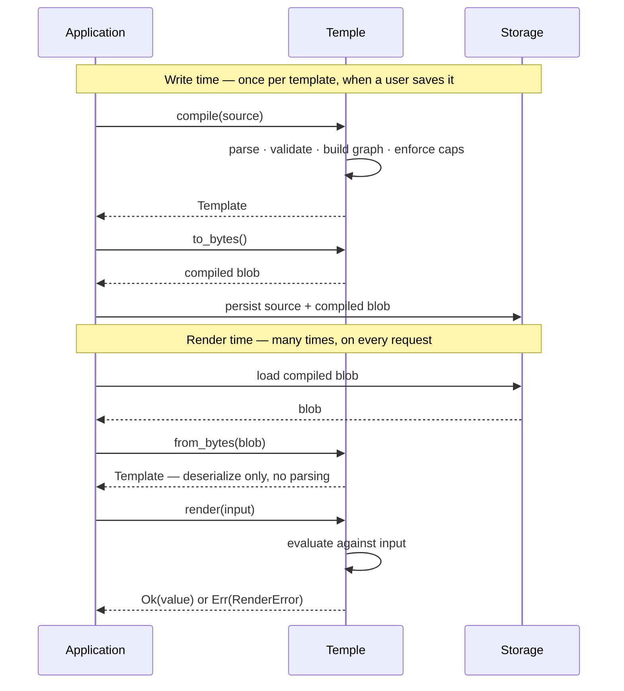
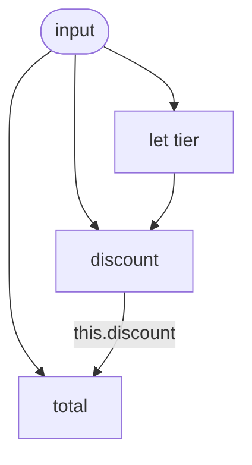

# Temple — Design

> [!NOTE]
> **The design — now realized.** This is the source of truth for what Temple
> *is*; milestones 1–8 of 9 implement it, including `format` and underlined
> diagnostics. See [`IMPLEMENTATION.md`](IMPLEMENTATION.md) for the as-built map
> and [`README.md`](README.md) for status. Everything here is settled unless
> flagged under [§10 Open question](#10-open-question). The remaining milestone
> (9) is a web editor component — see [`M9-EDITOR.md`](M9-EDITOR.md).

## Contents

1. [Overview](#1-overview)
2. [Template format](#2-template-format)
3. [Expression language](#3-expression-language)
4. [The value model](#4-the-value-model)
5. [Variables & self-reference](#5-variables--self-reference)
6. [Runtime model](#6-runtime-model)
7. [API & errors](#7-api--errors)
8. [Guarantees](#8-guarantees)
9. [Design decisions](#9-design-decisions)
10. [Open question](#10-open-question)
11. [Non-goals](#11-non-goals)
12. [Appendix](#12-appendix)

---

## 1. Overview

Temple turns an **input value** plus a **template** into a **strongly-typed Rust
value**. A template describes the *shape* of the output, with `{{ … }}` holes
where values are computed. It is a small, hand-rolled, dynamically-typed
expression interpreter — purpose-built for reshaping data, and fast at it.

**Use cases**

- **Templating** — fill dynamic slots in HTTP requests, payloads, or any structured document.
- **Rule engines** — act as the expression and evaluation layer.
- **Data normalization** — reshape varied inputs, such as API responses, into one canonical typed shape.

**The pipeline.** Work splits into two phases. Compilation — parsing,
validation, dependency analysis — happens **once**, when a template is saved.
The render path only loads a pre-compiled artifact and evaluates it; it never
parses.



---

## 2. Template format

A Temple template — a `.temple` document — is an optional `let` preamble
followed by an **output literal**:

```
# price a cart, with a loyalty discount
let tier = when {
  input.customer.spend >= 1000: 'gold'
  input.customer.spend >= 250:  'silver'
  else:                         'standard'
}

{
  "customer": {{ input.customer.name }},
  "tier":     {{ tier }},
  "discount": {{ input.cart.subtotal * (tier == 'gold' ? 0.15 : 0.0) }},
  "total":    {{ input.cart.subtotal - this.discount }},
  "note":     "Thanks, {{ input.customer.name }}!"
}
```

### Holes

An expression lives inside `{{ … }}`. The surrounding quotes decide the result:

| Hole | Result |
| --- | --- |
| **Bare** — `"k": {{ expr }}` | the expression's typed value — number, bool, string, array, object, or null |
| **Quoted** — `"k": "… {{ expr }} …"` | string interpolation — text and holes mix; the result is a string |

A whole expression — operators and all — lives in one hole. Holes do not
compose; expressions compose *inside* a hole.

### Comments

`#` begins a comment that runs to end of line, anywhere whitespace is allowed.

### Whitespace & commas

Newlines separate entries in objects, arrays, and `when` blocks. Commas are
optional, and trailing commas are always fine — adding a line never makes you
touch the line above. One nuance: a line ending in an operator continues its
expression onto the next line (`1 +⏎2` is one entry), so use commas where an
entry could read as a continuation.

### Output shapes

The output literal is one of:

| Shape | Looks like | Use |
| --- | --- | --- |
| Object | `{ "k": {{ … }}, … }` | structured output — the common case |
| Array | `[ {{ … }}, … ]` | a fixed-length list |
| Scalar | the whole template is one `{{ … }}` | a single value — e.g. a rule predicate |

The *literal* structure — an object literal's keys, how things nest — is fixed
by the template, and only the *values* in holes are dynamic. Array *lengths* can
still vary: a collection method (`map`, `filter`) over an input array yields an
array sized to that input ([§3](#3-expression-language)). What Temple lacks is
unbounded looping ([§11](#11-non-goals)).

### Why this format, not valid JSON

Three options were weighed:

| Option | Verdict |
| --- | --- |
| **Bare holes** (`.temple`) | **Chosen.** Bare-vs-quoted *is* the typed-vs-string rule, visibly; expressions may span lines. |
| Valid JSON (quoted holes, `$let` key) | Rejected. Needs a subtler "string is exactly one hole" rule; JSON strings can't span lines, cramping a `when` block onto one line. |
| Transpiler (author bare → store JSON) | Rejected. Two grammars, source maps, and two drifting artifacts — complexity, not simplicity. |

Accepted cost: a raw `.temple` file is not valid JSON, so JSON formatters do
not apply. The engine hand-writes its parser regardless. Where the source lives
is the caller's call — Temple just sees a string.

### Samples

One worked template per pattern lives in [`samples/`](samples/):

| Sample | Demonstrates |
| --- | --- |
| `minimal.temple` | flat object, direct path access, no preamble |
| `http_request.temple` | an HTTP request — URL/header interpolation, computed body |
| `receipt.temple` | `let` variables, conditionals, `this` self-reference, decimal math |
| `normalize.temple` | reshaping a third-party response; optional access for absent fields |
| `array_output.temple` | a top-level array output |
| `scalar_output.temple` | a whole-template-is-one-expression predicate |
| `collections.temple` | `map` / `filter` / `fold` over an input array |

---

## 3. Expression language

### Namespaces

An expression reads from three roots:

| Root | Refers to | Resolved |
| --- | --- | --- |
| `input.` | the render-time input | dynamically, at render time |
| `this.` | a sibling output key | statically, at compile time |
| bare name | a `let` variable, or a function call | — |

### Paths & safe access

A path navigates with `.key` (objects) and `[index]` (arrays): `input.cart.subtotal`,
`input.items[0]`, `this.discount`. A plain access **errors** if the key is absent
or the index out of range. Two operators opt out of that, and compose:

- **`?.`** *(optional access)* — `a?.b` yields `null` if `a` is `null`/absent or
  `b` is missing, short-circuiting the rest of the path.
- **`??`** *(null-coalescing)* — `a ?? b` yields `b` only when `a` is `null`.

Combine them for a default on a possibly-absent path — `input.cart?.coupon ?? 0`:
`?.` turns *missing* into `null`, `??` turns `null` into the fallback. `?.`
covers absence only; a real type error (`.key` on a number) still errors.

### Operators & precedence

Loosest to tightest binding:

```
?:                       conditional (ternary)
??                       null-coalescing
||                       logical or
&&                       logical and
== != < <= > >=          comparison
+ -                      additive
* / %                    multiplicative
- !                      unary prefix
.  []  ()  .m()  ?.      postfix: field, index, call, method, optional access
```

`&&`, `||`, and the conditionals **short-circuit** — an untaken branch or operand
is never evaluated.

### Conditionals

Both forms are expressions that yield a value:

- **Ternary** — `cond ? a : b` — the inline two-way pick.
- **`when`** — a guard table for multi-way branching:

  ```
  when {
    score >= 90: 'gold'
    score >= 75: 'silver'
    else:        'standard'
  }
  ```

  Conditions test top to bottom; the first true one's result becomes the value.
  `else` is the catch-all. The `:` reuses object syntax — *this maps to that* —
  no new symbol to learn.

The condition must be a `Bool` (no truthiness coercion). `else` is required —
a conditional is an expression and must yield a value; write `else: null` for
an explicit null. Evaluation short-circuits: testing stops at the first true
condition, and only the matched result is evaluated.

### Collection methods

Array values carry a fixed set of **bounded** iteration methods. Each takes a
**lambda** — `param -> expr`, or `(p1, p2) -> expr` for two parameters — and
walks the array once:

| Method | Result |
| --- | --- |
| `arr.map(x -> expr)` | a new array — `expr` applied to each element |
| `arr.filter(x -> expr)` | a new array — the elements where `expr` is `true` |
| `arr.fold(init, (acc, x) -> expr)` | one value — `expr` accumulated left-to-right from `init` |

`len`, `sum`, `any`, and `all` round out the set as convenience methods — each
expressible as a `fold`. Methods chain into a pipeline:

```
input.cart.items
  .filter(it -> it.in_stock)
  .map(it -> { "sku": it.sku, "total": it.qty * it.price })
```

A lambda parameter is a **local binding**, scoped to the lambda body; the body
may also read `input`, `this`, and `let` variables from the enclosing scope.
Lambdas exist only as method arguments — they cannot be named, stored, or call
themselves, so there is no recursion.

Iteration is **bounded**: the input array is finite and each method walks it
once. A render always terminates and stays non-Turing-complete — Temple has
collection methods, not loops. What this costs a render is covered in
[§6](#6-runtime-model).

### Functions

Functions are called as `name(arg, …)` — pure helpers dispatched by matching the
name (not a string-keyed map):

- **numeric:** `abs`, `round`, `floor`, `ceil`, `min`, `max`
- **string:** `upper`, `lower`, `trim`, `concat` (variadic, auto-stringifies scalars)
- **conversion / introspection:** `to_string`, `to_number`, `type_of`, `is_null` / `is_bool` / `is_number` / `is_string` / `is_array` / `is_object` (length is the `.len()` *method* — one spelling)
- **encoding:** `json_encode`, `url_encode`, `base64`

Operations *on a collection or string receiver* are methods (`arr.sort()`,
`s.split(",")`, `obj.merge(other)`); standalone helpers are functions. Methods
chain off any expression, not just a path — `[1, 2].sort()`, `f(x).method()`.

A local binding can be introduced mid-expression with **`let NAME = EXPR in EXPR`** —
usable anywhere, including inside a `when` branch; it shadows outer names and never
leaks past its body.

### Literals & constructors

Literals are numbers (`42`, `0.0825`), single-quoted strings (`'gold'`), `true`,
`false`, and `null`. Single quotes keep string literals clear of the output's
double quotes.

An expression can also **construct** values — an object literal
`{ "k": expr, … }` or an array literal `[ expr, … ]`. This is how a `map` lambda
reshapes each element into a new object. Object literals also allow a **computed
key** `{ [expr]: v }` (the key expression must evaluate to a string) and an
**omit-if-null** entry `"k"?: expr` that drops the key when its value is null —
the same `"k"?:` works on output-object keys too. Together with `obj.merge` and
`obj.get`, computed keys enable group-by/index-by reshaping.

---

## 4. The value model

### The `Value` type

Every runtime value is one variant of:

```rust
enum Value {
    Null,
    Bool(bool),
    Int(i64),
    Decimal(Decimal),
    Str(SmolStr),
    Arr(Vec<Value>),
    Obj(IndexMap<SmolStr, Value>),
}
```

`Int` and `Decimal` are separate — integers stay exact, fractional values use
`rust_decimal`. **No `f64` exists anywhere in the model**, so `129.99 * 0.0825`
is exactly `10.724175`. This is why Temple defines its own `Value` instead of
reusing `serde_json::Value`, whose single `Number` cannot carry an exact decimal.
(`smol_str` keeps small keys inline; `indexmap` preserves key order.)

### Dynamically typed

Temple has no static type system and no input schema. `Value` is the only type;
expressions are checked as they evaluate. Rust's type system re-enters at exactly
one boundary — the final `Value → T` deserialize via serde.

A static input schema was considered and rejected: across thousands of evolving
templates, a schema-per-template does not scale, and it fights the dynamic
reshaping Temple exists for. The accepted cost — a typo'd path surfaces at render
time, not compile time — is softened by compile-time structure checks
([§5](#5-variables--self-reference)) and clear render errors. An *optional*
contract on top of the dynamic core is the [open question](#10-open-question).

### Input

`render` accepts `impl Into<Value>` — Temple's `Value`, or any map-shaped type
via `From`. The top-level input must be an object; that object is `input`. There
is **one** input root — context, secrets, env all nest under it. Taking `Value`
rather than a generic `impl Serialize` is deliberate: the caller builds
`Value::Decimal` explicitly, so precision is never lost to an `f64` field on the
way in.

With the opt-in `json` feature, `serde_json::Value` converts in both directions
through the same precision rule: numbers travel as their **verbatim tokens**
(`"129.99"` → exact `Decimal`, and back out as an exact JSON number token),
never through `f64`.

---

## 5. Variables & self-reference

`let` **variables** are declared in the preamble, computed from `input`, other
variables, or `this`. They are reused across holes and **never emitted** in the
output.

`this.<key>` is **self-reference** — it reads another output key's computed
value. Output keys may be written in any order; the engine resolves
*dependencies*, not file order.

### The dependency graph

Variables and output keys are nodes in one directed graph; each `this.x` or
variable reference is an edge. At **compile time** the engine builds the graph,
topologically sorts it, **rejects any cycle**, and checks that every reference
resolves to a real key or variable. At **render time** each node is evaluated
once, in dependency order, and memoized; unused variables are pruned.

This is where Temple keeps compile-time guarantees despite being dynamically
typed: `input.*` is dynamic, but the template's internal wiring is fully static
and checked — as long as references use literal names, not computed keys.

For a template with `let tier`, a `discount` key that uses it, and a `total` key
that reads `this.discount`, `compile` builds:



It sorts this graph and rejects any edge that would close a cycle.

---

## 6. Runtime model

### Compile at write time

Templates are created and updated through the application — an app-mediated save
path. The save handler compiles, then stores the result:

```rust
let compiled = Template::compile(&source)?;     // parse · validate · DAG · caps
storage.save(id, source, compiled.to_bytes());  // a &str and a Vec<u8>; where they live is your call
```

Saving is human-paced, so compilation cost is invisible — and syntax, cycle, and
cap errors reach the author immediately.

### Artifacts

`compile` produces two things to keep — both opaque to Temple, both the
caller's to persist wherever they like:

| Artifact | Purpose |
| --- | --- |
| Source text (`&str`) | Source of truth — human-readable, diffable, version-proof; recompile from it if the blob format ever changes. |
| Compiled blob (`Vec<u8>` from `to_bytes()`) | Render-path artifact — derived, version-tagged, regenerable from the source. A cache, never the source of truth. |

### The render path never parses

```rust
let template = Template::from_bytes(&blob)?;                 // deserialize — no parsing
let out: Result<T, RenderError> = template.render(input);    // the caller handles it
```

An in-memory `Arc<Template>` cache keyed by `(template_id, version)` sits on top:
a hit is a pure render; a miss costs a load from wherever you persist the blob,
plus `from_bytes` — a bounded deserialize, never a parse. The compiled `Template` is immutable and
`Send + Sync`, shared across all workers.

### Size caps

`compile` enforces limits — maximum source bytes, AST nodes, and nesting depth —
rejecting an oversized template at save time. One cap at the write chokepoint
bounds every downstream cost: parse, deserialize, and render. (The depth cap also
guards the recursive parser against stack overflow.)

### Why this works

The performance promise — sub-1 ms typical, sub-100 µs simple — is a
**render-path** promise. Parsing is `O(template size)` and cannot be guaranteed
to stay in microseconds for an arbitrarily large template, so it is removed from
the render path entirely — by lifecycle, not by hope. Caching reduces how *often*
a template is loaded but cannot *bound* a parse, so the guarantee does not rest
on it. It rests on three facts: parsing happens at write time; the render path
only deserializes; and size caps bound that deserialize. Render latency is
bounded by construction, independent of cache state.

Collection methods ([§3](#3-expression-language)) add one qualifier — a render
that walks input arrays costs `O(template size + elements visited)`. That is
still **bounded and terminating** (the input is finite; each method walks it
once), just no longer bounded by template size alone. An optional render-time
operation budget can cap total work where a hard ceiling is wanted.

---

## 7. API & errors

```rust
// Author-time (called by your save handler or template editor)
Template::compile(src: &str)  -> Result<Template, Vec<CompileError>>
Template::validate(src: &str) -> Result<(), Vec<CompileError>>      // same checks, no Template kept
Template::format(src: &str)   -> Result<String, Vec<CompileError>>  // canonical, idempotent layout
Template::to_bytes(&self)     -> Vec<u8>

// Render time (hot path)
Template::from_bytes(bytes: &[u8]) -> Result<Template, LoadError>
Template::render<T: DeserializeOwned>(&self, input: impl Into<Value>)
    -> Result<T, RenderError>                                      // into your own type
Template::render_value(&self, input: impl Into<Value>)
    -> Result<Value, RenderError>                                  // the dynamic Value, no serde round-trip
```

`render::<Value>` is intentionally a compile error — `Value` is not a deserialize
target. Use `render_value` to get the dynamic value back.

`validate` and `format` are author-time helpers — call them from a save handler
or an editor integration to give the author immediate feedback. `validate` runs
the full compile pipeline and discards the result; `format` runs the parser and
the size caps only (so a template can be formatted before its names resolve)
and re-emits the source in a canonical layout.

### Errors

Every fallible operation returns a `Result`. Error types are **structured
enums** carrying rich context:

| Error | From | Carries |
| --- | --- | --- |
| `CompileError` | `compile`, `validate`, `format` | syntax · cycle · unknown function · cap exceeded — each with a source span |
| `LoadError` | `from_bytes` | corrupt or version-incompatible blob |
| `RenderError` | `render` | missing path · type mismatch · function failure · arithmetic overflow · divide by zero · value-too-deep · deserialize failure — each with the offending sub-expression's span |

`compile` / `validate` return `Vec<CompileError>` so the author fixes everything
in one save: the **resolver** collects every reference, cycle, and validation
error in one pass, and the **parser** recovers at object-field / array-item
boundaries so independent syntax errors come back together too. `render` fails
fast on the first error (it's the hot path).

`CompileError::report(src)` quotes the source, underlines the offending fragment
with a line/column caret, and suggests a fix where the name is statically known —
e.g. `this.taxs` → *did you mean `this.tax`?* This rests on a source span sitting
on every AST node from day one (retrofitting spans is painful); `Display` keeps a
terse byte-offset form for when there's no source at hand.

**Temple never panics on a template or input, and never decides how a failure is
handled.** A failure is a typed value the caller owns. `render::<T>` returns
`Result<T, RenderError>` — a render that cannot produce a valid `T` is an `Err`,
never a panic and never a partial value.

---

## 8. Guarantees

| Guarantee | How it holds |
| --- | --- |
| **Bounded, terminating renders** | The render path never parses and never loops unboundedly; cost scales with template size plus the input elements a render visits. |
| **Decimal correctness** | No `f64` in the value model; integer and decimal arithmetic are exact. |
| **No cycles** | The variable / `this` dependency graph is proven acyclic at compile time. |
| **Valid internal references** | Every `this.x` and variable reference is checked at compile time. |
| **Compile-once** | Parsing, validation, and graph analysis run exactly once per template version. |
| **Early rejection** | Size, node, and depth caps fail a pathological template at save, not in production. |
| **Deterministic renders** | No I/O, side effects, or clocks — same template + input ⇒ same output. |
| **Typed output** | The result deserializes into the caller's Rust type; a shape mismatch is a clear error. |
| **No panics** | `compile`, `from_bytes`, and `render` return typed errors; the caller owns handling. |
| **Author-time feedback** | All syntax, cycle, and cap errors surface at save — located in the source, with suggestions when names are known. |

---

## 9. Design decisions

| Decision | Path chosen | Why |
| --- | --- | --- |
| Template format | Bare holes, `.temple`, not valid JSON | Visible type rule; multi-line expressions; engine no simpler with JSON; a transpiler would only add complexity |
| Typing | Dynamic; no static schema | Scales to many evolving templates; doesn't fight dynamic reshaping |
| Value type | Own `Value` enum, not `serde_json::Value` | Needs an exact `Decimal` variant; no `f64` |
| Input | `impl Into<Value>`, one `input` root | Explicit precision; one nested root is enough |
| Missing path | Render error by default; `?.` / `??` to opt out | Silent null is the classic footgun |
| Optional access | Per-hop `?.` | Precise; frees lone `?` for the ternary |
| Conditionals | `when` guard table + ternary, both expressions | Ternary for inline 2-way; `when` for readable multi-way; `:` reuses object syntax |
| Variables & self-ref | `let` preamble + `this`, one compile-time graph | Compute-once, order-free, cycle-checked |
| Compile vs render | Compile at write time; render never parses | Render latency bounded by construction |
| Storage | Source text + compiled blob | Durable & version-proof, plus a fast render path |
| Caching | App-held `Arc<Template>`, keyed by id+version | The cache is an optimization, not the latency guarantee |
| Errors | `Result` everywhere · no panics · structured enums with source spans · all compile-time errors reported at once | Caller owns failure handling; authors get located, multi-reported diagnostics |
| Author tooling | `format` and `validate` exposed as crate methods (no CLI) | Authoring is in-app; tools belong in the crate; cheap to call from the save handler |
| Iteration | Bounded collection methods — `map` / `filter` / `fold`; no `while` or recursion | Normalization and rule engines need it; bounded keeps termination and non-Turing-completeness |

---

## 10. Open question

**How should Temple handle reads of input that may not exist — and can it offer
type safety and "required field" enforcement?**

*Settled (v1):* a missing path is a render error; `?.` and `??` opt individual
accesses into tolerating absence. This handles *absence*, dynamically, per access.

*Open:* whether to offer an **optional input contract** — a declared description
of expected input fields, their types, and which are required — that would:

- validate input up front, with a precise *"required field `x` not provided"* error;
- give templates type safety (e.g. `input.price` guaranteed numeric before arithmetic);
- be partly checkable at compile time.

A *mandatory* static schema was rejected ([§4](#4-the-value-model)) — it does not
scale and fights dynamic reshaping. Any contract must therefore be **opt-in** and
must not compromise the dynamic core. The open work is the *shape* of that
contract: where it is declared, how it is expressed, and how much is enforced at
compile vs. render time. Parked until the dynamic core exists and real templates
inform the design.

---

## 11. Non-goals

Temple is intentionally small. It is **not** a general-purpose or Turing-complete
language, a text templating engine (HTML, email, config files), or a host for
I/O or side effects.

In particular, there is **no unbounded looping** — no `while`, no general
recursion, nothing that can fail to terminate. Temple *does* have bounded
iteration: the `map` / `filter` / `fold` collection methods
([§3](#3-expression-language)), each of which walks a finite input exactly once.

---

## 12. Appendix

### Tech stack

| Crate | Role |
| --- | --- |
| `rust_decimal` | exact decimal arithmetic |
| `smol_str` | small inline strings for keys and identifiers |
| `indexmap` | order-preserving maps for objects |
| `serde` | AST serialize/deserialize (the blob) + typed result deserialization |
| `ciborium` | compiled-blob format (CBOR — self-describing) |
| `serde_json` | optional (`cli` feature) — JSON I/O for the `temple` binary |
| `criterion` | benchmarking (dev) |
| *(parser)* | hand-written recursive descent — no parser crate |

Size: ~4,000 lines of Rust (the hand-written parser is ~1,600 of them).

### Roadmap

- [x] Parser and AST — with source spans on every node
- [x] `Value` and the evaluator
- [x] Paths, operators, precedence
- [x] Conditionals — `when` guards and ternary
- [x] Collection methods — `map` / `filter` / `fold`, with lambdas
- [x] `let` variables and `this` — the dependency graph
- [x] Built-in functions
- [x] `compile` / `validate` — size/depth caps, resolver multi-error reporting
- [x] `to_bytes` / `from_bytes` — the compiled blob
- [x] `render` and serde deserialization of results
- [x] `criterion` benchmark suite
- [x] `format`, parser error recovery, source-underlined diagnostics (line/column, did-you-mean) — milestone 8
- [ ] web editor component — intellisense, inline diagnostics + warnings, format-on-save ([M9](M9-EDITOR.md))

### The name

*Temple* is *template* with the middle worn away — and a temple is a structure of
niches waiting to be filled, much like a template. Names considered and set
aside: *pagoda*, *pantheon*, *cast*, *agora*, *weave*, *yantra*, *mint*.
