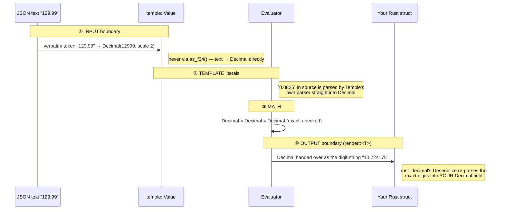

# Temple — FAQ

Implementation-level questions about how the engine actually works. For the
design see [`DESIGN.md`](DESIGN.md); for the build plan,
[`IMPLEMENTATION.md`](IMPLEMENTATION.md).

---

## How are `{{ … }}` placeholders filled in?

At compile, the output literal becomes a tree of `OutNode`s; each `{{ … }}` is
recorded as a hole with an expression ID. At render, the engine recursively
walks the tree and builds the output `Value`:

```rust
enum OutNode {
    Literal(Value),                   // "POST", 3, true — no holes
    Hole(ExprId),                     // {{ expr }} as a value
    Object(Vec<(SmolStr, NodeId)>),   // { "k": <node>, ... }
    Array(Vec<NodeId>),               // [ <node>, ... ] — literal brackets in the template
    Interp(Vec<StrPart>),             // "Hi {{ name }}!"
}
enum StrPart { Text(SmolStr), Hole(ExprId) }

fn build(node: NodeId, ctx: &Ctx) -> Result<Value, RenderError> {
    match &nodes[node] {
        OutNode::Literal(v)   => Ok(v.clone()),
        OutNode::Hole(eid)    => eval_expr(*eid, ctx),
        OutNode::Object(fs)   => Ok(Value::Obj(
            fs.iter().map(|(k, n)| Ok((k.clone(), build(*n, ctx)?))).collect()?
        )),
        OutNode::Array(items) => Ok(Value::Arr(
            items.iter().map(|n| build(*n, ctx)).collect()?
        )),
        OutNode::Interp(ps)   => { /* text parts as-is; holes stringified */ }
    }
}
```

- A **bare hole** emits the expression's typed `Value`.
- A **quoted hole** (interp string) stringifies each hole's value and
  concatenates with the literal text parts.

---

## How does input get parsed, and how is `input.value.nestedValue` resolved?

The caller hands `render` any `impl Into<Value>` — `serde_json::Value`,
`HashMap<String, V>`, or your own struct via `Serialize`. The `From` impls drop
it into Temple's `Value` enum **once**, before render starts. From there it's
just a `Value::Obj(IndexMap<SmolStr, Value>)` sitting under the name `input`.

At parse, `input.value.nestedValue` becomes a root + segment list — built
**once** at compile, not re-parsed per render:

```rust
enum Expr { Path { root: PathRoot, segs: Vec<Seg> }, /* … */ }
enum PathRoot { Input, This, Var(VarId) }
enum Seg { Field(SmolStr), Index(i64), OptField(SmolStr), OptIndex(i64) }
```

At render, walk one segment at a time:

```rust
fn eval_path(root: &Value, segs: &[Seg], ctx: &Ctx) -> Result<Value, RenderError> {
    let mut cur = root;
    for seg in segs {
        cur = match (cur, seg) {
            (Value::Obj(m), Seg::Field(k))     => m.get(k).ok_or_else(|| missing(k, ctx))?,
            (Value::Arr(v), Seg::Index(i))     => v.get(*i as usize).ok_or_else(|| out_of_range(*i, ctx))?,
            (Value::Obj(m), Seg::OptField(k))  => m.get(k).unwrap_or(&Value::Null),
            (Value::Arr(v), Seg::OptIndex(i))  => v.get(*i as usize).unwrap_or(&Value::Null),
            (Value::Null,   Seg::OptField(_) | Seg::OptIndex(_)) => &Value::Null,
            (other, Seg::Field(_) | Seg::Index(_)) => return Err(type_mismatch(other.kind(), ctx)),
            // …
        };
    }
    Ok(cur.clone())
}
```

So `input.value.nestedValue` is just three dictionary lookups on the input
`Value`. No reflection, no string parsing per call. `?.` flips the same lookup
into "missing ⇒ Null, propagate."

---

## How are arrays handled at runtime?

Two distinct cases — important to keep straight:

**(a) Array *literals* in the output template** — when you write:

```
"keys": [{{ input.a }}, {{ input.b }}, 42]
```

This is a fixed-shape, three-element array. The parser builds it as
`OutNode::Array([NodeId(hole_a), NodeId(hole_b), NodeId(literal_42)])`. At
render, each child is built; results collect into a `Value::Arr` of length 3.

**(b) Computed arrays inside an expression** — when you write:

```
"items": {{ input.cart.items.map(it -> it.qty * it.price) }}
```

The output node is a single `OutNode::Hole(eid)`. The expression at `eid` is a
method call:

```rust
enum Expr {
    Method { receiver: ExprId, kind: MethodKind, args: Vec<ExprId> },
    Lambda { params: Vec<VarId>, body: ExprId },
    // …
}
enum MethodKind { Map, Filter, Fold, Len, Sum, Any, All }
```

Evaluation:

```rust
fn eval_method(recv: Value, kind: MethodKind, args: &[ExprId], scope: &mut Scope) -> Result<Value, RenderError> {
    let items = match recv {
        Value::Arr(v) => v,
        other => return Err(method_on_non_array(other)),
    };
    match kind {
        MethodKind::Map => {
            let (param, body) = unwrap_lambda(args[0]);
            let mut out = Vec::with_capacity(items.len());
            for it in items {
                scope.vars[param.0] = it;
                out.push(eval_expr(body, scope)?);
            }
            Ok(Value::Arr(out))
        }
        MethodKind::Filter => { /* same loop, keep where body == Bool(true) */ }
        MethodKind::Fold   => {
            let init = eval_expr(args[0], scope)?;
            let ([acc_p, x_p], body) = unwrap_lambda2(args[1]);
            let mut acc = init;
            for it in items {
                scope.vars[acc_p.0] = acc;
                scope.vars[x_p.0]   = it;
                acc = eval_expr(body, scope)?;
            }
            Ok(acc)
        }
        MethodKind::Len => Ok(Value::Int(items.len() as i64)),
        // sum/any/all — literally fold under the hood
    }
}
```

Lambdas are AST nodes, not values; their params are pre-allocated `VarId`s, so
a call is just "write the param slot, eval the body." No allocation per call.

---

## If my hole evaluates to an array, can I `.map` over it?

**Yes.** The two cases above aren't a constraint — they're how the AST records
*statically-written* arrays differently from *computed* arrays. From the
template author's point of view there's no choice to make: write any
expression in `{{ … }}`, including chained collection methods.

`OutNode::Array([ … ])` exists only when the *template literal* has brackets:
`"keys": [a, b, c]`. The brackets were in your source.

If your hole's expression produces an array, the output node is
`OutNode::Hole(eid)`, and inside the expression you have the full language:

```
"high_value":  {{ input.items.map(it -> it.price).filter(p -> p > 100) }}
"total":       {{ input.items.map(it -> it.qty * it.price).fold(0, (a, b) -> a + b) }}
"first_skus":  {{ input.items.filter(it -> it.in_stock).map(it -> it.sku) }}
```

Each is a single output hole — `OutNode::Hole(eid)` — whose expression yields
a `Value::Arr` of whatever length. The output node doesn't care about shape;
the expression does the work.

The thing you *can't* do is mix the template's bracket syntax with method
syntax outside a hole — e.g. write `[1, 2, 3].map(...)` at the output level.
Methods live in expressions, so the chain has to be inside a `{{ … }}`.

---

## A complete render trace

For `{{ input.cart.items.map(it -> it.qty * it.price).fold(0, (a, b) -> a + b) }}`:

1. The output AST has `Hole(eid)` here. `build` calls `eval_expr(eid)`.
2. `eval_expr` sees `Method { kind: Fold, … }` — evaluate the receiver first.
3. Receiver is `Method { kind: Map, … }` — evaluate *its* receiver first.
4. Receiver of `map` is `Path { Input, [Field("cart"), Field("items")] }` — `eval_path` walks two `.get`s on the input → `Value::Arr(items)`.
5. `.map(it -> it.qty * it.price)` — loop items, bind `it`, evaluate `it.qty * it.price` (two paths + a `Decimal *`) → `Value::Arr(prices)`.
6. `.fold(0, (a, b) -> a + b)` — loop, bind `a, b`, evaluate `a + b`, accumulate → `Value::Decimal(total)`.
7. That `Value` becomes the hole's result. `build` slots it into the output object at the current key.

No reflection, no string lookups, no type erasure. Everything is a `match` on
small enums plus array indexing.

---

## Why does Temple have its own `Value` instead of `serde_json::Value`?

Because of **one variant**. Both enums are "data in memory", but they disagree
on what a number is:

```text
serde_json::Value                     temple_dsl::Value
─────────────────                     ─────────────────
Null                                  Null
Bool(bool)                            Bool(bool)
Number(Number)  ◄── ONE number slot   Int(i64)          ◄── TWO number slots
                    (i64 | u64 | f64) Decimal(Decimal)  ◄──
String(String)                        Str(SmolStr)
Array(Vec)                            Arr(Vec)
Object(Map)                           Obj(IndexMap)
```

In `serde_json`, any number with a decimal point becomes an `f64` — a *binary*
float that physically cannot store most decimal fractions:

```text
0.1 + 0.2            == 0.30000000000000004      ← visibly wrong
129.99 is stored as     129.99000000000000909495 ← prints as "129.99", but it's lying
```

The second line is the dangerous one: the error is usually invisible (printing
rounds it away) and surfaces randomly — a total off by a cent, a `==` that
fails. Temple's contract is *exact decimals*, so its `Value` keeps integers in
`Int` and fractional numbers in `Decimal` — and has **no f64 variant at all**.
The wrong type doesn't exist, so the mistake can't be made.

Owning the type also bought three things a borrowed type couldn't:

| | Why it needs our own type |
| --- | --- |
| **Ordered keys** | `Obj` is an `IndexMap` — output keys always come out in template order |
| **`render::<Value>` is a compile error** | `Value` deliberately doesn't implement `Deserialize` (see below) |
| **Stack-safe drop** | `Value` has an iterative `Drop`, so even a pathologically deep value can't overflow the stack — part of the no-panic guarantee |

---

## How does `Decimal` stay exact end to end?

`rust_decimal::Decimal` stores **base-10 digits** — an integer mantissa plus a
"where's the decimal point" scale — so decimal math is integer math underneath:

```text
129.99  is stored as  (mantissa: 12999, scale: 2)  →  12999 × 10⁻²
0.0825  is stored as  (mantissa:   825, scale: 4)  →    825 × 10⁻⁴
multiply: 12999 × 825 = 10724175, scales add 2+4=6 →  10.724175   EXACT
```

The danger zones are the **boundaries** — anywhere data crosses in or out, an
f64 detour could silently corrupt the digits. Every crossing is guarded:



1. **Input** — library callers build `Value::Decimal` directly (this is why
   `render` takes `impl Into<Value>`, not `impl Serialize`: a generic
   `Serialize` would let a struct's `f64` field sneak corrupted digits in).
   JSON input converts via the `json` feature's `From<serde_json::Value>`,
   which parses the **verbatim number token** into `Decimal` — never `as_f64()`.
2. **Template literals** — `0.0825` in template source never touches serde;
   Temple's parser reads the characters into a `Decimal`.
3. **Math** — decimal-to-decimal with checked arithmetic; `Int` mixed with
   `Decimal` promotes to `Decimal`. No float ever appears mid-evaluation.
4. **Output** — serde's number vocabulary is i64/u64/f64, so handing a
   `Decimal` over *as a number* would force the f64 detour at the last step.
   Instead the custom `Deserializer` emits it as a **string of exact digits**;
   `rust_decimal`'s own `Deserialize` re-parses them losslessly into your
   struct's `Decimal` field. (An `f64` struct field still works — that's an
   explicit opt-in where *you* chose the approximation.) Converting to
   `serde_json::Value` via the `json` feature emits a real JSON **number
   token** with the exact digits, courtesy of `arbitrary_precision`.

---

## Why is `render::<Value>` a compile error?

Deserializing a `Value` into a `Value` would be a pointless full copy through
serde. Because Temple owns the type, the trap became a compile error: `Value`
simply doesn't implement `Deserialize`.

```rust
template.render::<Receipt>(input)            // ✓ typed output
template.render::<serde_json::Value>(input)  // ✓ JSON output
template.render::<temple_dsl::Value>(input)  // ✗ does not compile
template.render_value(input)                 // ✓ the direct way — no serde round-trip
```

Internally this is why the AST stores literals as a separate `Lit` type rather
than `Value`: the serialized blob needs `Deserialize` on everything it
contains, and keeping `Value` out of the AST keeps it out of `Deserialize`.

---

## How do I use `serde_json::Value` with Temple?

Enable the `json` feature and the conversions are built in, exact in both
directions:

```toml
temple-dsl = { git = "…", branch = "release", features = ["json"] }
```

```rust
// IN: serde_json::Value goes straight into render (via From / Into<Value>)
let input: serde_json::Value = serde_json::from_str(body)?;
let out = template.render_value(input)?;

// OUT: convert back — decimals become exact JSON number tokens
let json = serde_json::Value::from(out);
```

The input conversion parses each number's verbatim token (`"129.99"` →
`Decimal`, never through `f64`); the output conversion emits decimals as real
JSON numbers with the exact digits. A number beyond `Decimal`'s range
(≈ ±7.9 × 10²⁸) converts to `Null` rather than silently rounding. The core
crate stays dependency-lean: `serde_json` only enters the tree when the `json`
(or `cli`) feature is on.
