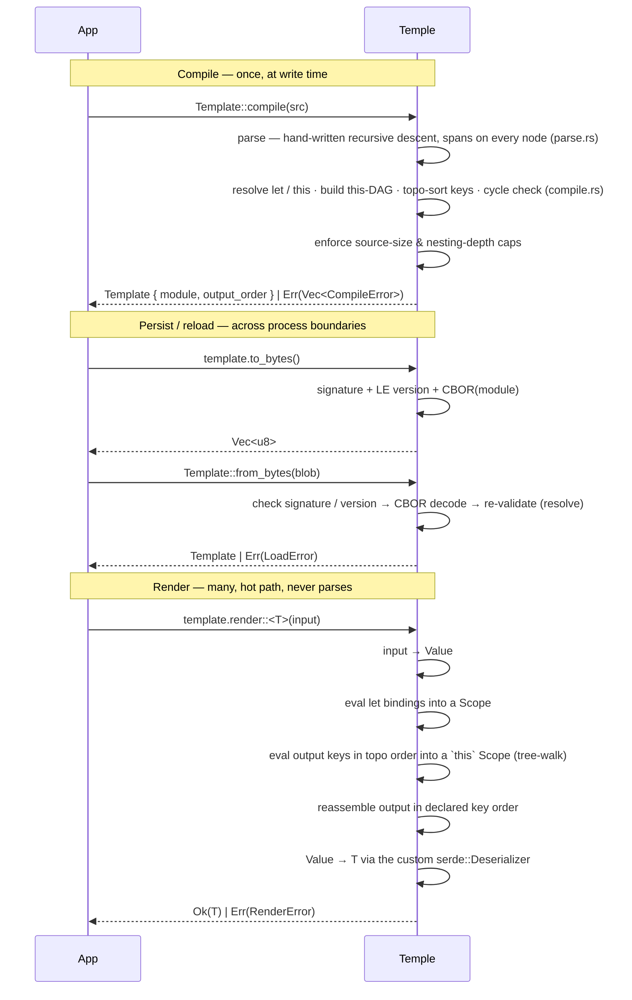

# Temple — Implementation

> [!NOTE]
> **As-built — milestones 1–8 of 9 done.** This documents what actually
> exists in `src/`; the forward-looking design lives in [`DESIGN.md`](DESIGN.md).
> The one open milestone (9) is the web editor component — see
> [`M9-EDITOR.md`](M9-EDITOR.md) and [Build order](#build-order).

## TL;DR

Hand-written recursive-descent parser (with error recovery) → boxed-tree AST
with a `Span` on every node → resolver builds the `this`-dependency DAG and
topo-sorts the output keys → tree-walking evaluator → versioned CBOR blob, plus a
canonical formatter and underlined-snippet diagnostics. ~4.9k LoC across `lib.rs`
+ six implementation areas (`parse`, `compile`, `eval/`, `value`, `error`,
`format`) + a feature-gated CLI.

---

## Stack

| Crate | Role |
| --- | --- |
| `rust_decimal` | exact decimal arithmetic — no `f64` in the value model |
| `smol_str` | small inline strings for keys and identifiers |
| `indexmap` | order-preserving maps for object values |
| `serde` | AST `Serialize`/`Deserialize` (the blob) + the result deserialize boundary |
| `ciborium` | compiled-blob format (CBOR — self-describing, which `rust_decimal`'s `deserialize_any` requires and bincode can't give) |
| `serde_json` | **optional** (`json` / `cli` features) — exact `From` conversions to/from `serde_json::Value`, JSON I/O for the `temple` binary |
| `criterion` | benchmarks (dev) |
| `cargo-husky` | git hooks — `fmt` + `clippy` pre-commit (dev) |

The parser is **hand-written**, not a combinator crate — full control over spans
and error messages, and one fewer dependency. Diagnostics are rolled in
`error.rs`, no diagnostic crate.

---

## File layout

Six implementation areas + a `lib.rs` facade + the CLI. ~5.1k LoC — past the
early ~2k estimate, mostly the hand-written parser (~1.8k) and the method stdlib.

| File | LoC | Role |
| --- | ---: | --- |
| `lib.rs` | 10 | public surface — re-exports `Template`, the error enums, `Value` |
| `value.rs` | 278 | the `Value` enum, `From`/`Into` conversions, a custom `serde::Deserializer` over `&Value`, and an iterative `Drop` |
| `error.rs` | 277 | `CompileError` / `RenderError` / `LoadError`, `Span` (+ `line_col`), `Display`, and underlined-snippet `report` rendering |
| `parse.rs` | 1790 | AST node types (serde-derived), hand-written recursive-descent parser, spans, depth cap, comma-or-newline separators, error recovery, postfix access, `let … in …` |
| `compile.rs` | 682 | `resolve` (let / this), `this`-DAG + cycle check, caps, did-you-mean, `Template`, `to_bytes` / `from_bytes`, `validate`, `format`, `render` / `render_value` |
| `eval/` | 1700 | the tree-walking evaluator, split by domain ↓ |
| `format.rs` | 284 | canonical, idempotent pretty-printer over the AST |
| `main.rs` | 120 | feature-gated `temple` CLI — `render` and the `fmt` subcommand |

The evaluator was one large file; it is now a module split by concern:

| `eval/` file | LoC | Role |
| --- | ---: | --- |
| `mod.rs` | 232 | dispatch root — `evaluate` / `evaluate_expr`, the `Scope` map, and the layered `Scopes` view (a `let … in …` adds an O(1) overlay, never a scope clone) |
| `ops.rs` | 225 | binary/unary operators — arithmetic (`+ - * / %`), comparison, equality, logical |
| `path.rs` | 262 | path/postfix traversal over a borrow cursor, array + object indexing, the value-depth guard |
| `methods.rs` | 571 | the method stdlib, split per receiver (`str_method` / `arr_method` / `obj_method`) + the lambda binding |
| `functions.rs` | 410 | built-in functions, the `BUILTINS` list, `fold_compare` (shared by `min`/`max` fn + method), encodings, scalar stringification |

---

## Architecture

A boxed-tree AST, not an arena. Every `OutNode` / `Expr` carries a `Span`, and
the whole `Module` derives `Serialize`/`Deserialize` so the compiled form
round-trips through CBOR as-is. `Lit` is kept deliberately distinct from `Value`
so the serialized AST never forces `Value: Deserialize` — that gap is exactly
what makes `render::<Value>` a compile error.

**Phase → file**

- `parse` (recursive descent + spans + recovery) → `parse.rs`
- `resolve · this-DAG · caps · did-you-mean · to_bytes/from_bytes · validate · format · render` → `compile.rs`
- `evaluate output nodes & expressions, methods, functions` → `eval/`
- error types + `Display` + underlined-snippet `report` rendering → `error.rs`
- `Value`, conversions, the `&Value` deserializer → `value.rs`
- canonical pretty-printer over the AST → `format.rs`

---

## Key design choices

- **Hand-written recursive-descent parser** with precedence-climbing
  (`parse_ternary` → `parse_coalesce` → … → `parse_primary`) — full control over
  spans and messages, zero parser dependency.
- **A `Span` on every AST node from day one** — retrofitting source spans is painful.
- **Boxed-tree AST** (`Expr { kind, span }`, `Box<Expr>` children), serde-derived
  — serializes cleanly to CBOR as the compiled blob; no separate arena/IR.
- **`Lit` ≠ `Value`** — the serialized AST never requires `Value: Deserialize`,
  which is what keeps `render::<Value>` a deliberate compile error.
- **Compile-time topo-sort of output keys** over the `this`-dependency DAG; render
  evaluates keys in dependency order into a `this` scope, then reassembles them in
  **declared** order. Cycles are rejected at compile.
- **Tree-walking evaluator** (`eval/`, split by domain) — fits the perf budget;
  benchmarked, not bytecoded.
- **Borrow-cursor path traversal** — `input.a.b.c` stays a borrow into the input
  and clones the final value once at the end, never the whole subtree.
- **Lambda scope cloned once per walk**, not per element — `map`/`filter`/`fold`
  overwrite only the parameter bindings each iteration.
- **Built-ins dispatched by matching the function name (`&str`)** — a small fixed
  set, no hash map on the hot path; `is_known_function` gates them at compile time.
- **No-panic guarantee, enforced structurally**: checked arithmetic, a parser
  depth cap (`MAX_DEPTH = 64`) and source-size cap (1 MiB), a render-time
  value-depth cap (`MAX_VALUE_DEPTH = 128` → `RenderError::ValueTooDeep`), and an
  **iterative `Drop` for `Value`** so dropping a deeply nested value can't overflow
  the stack.
- **Blob = `[signature "TMPL" (4B)][format_version: u32 LE][CBOR module]`** — a bad
  signature ⇒ `LoadError::Corrupt`, a version mismatch ⇒ `LoadError::IncompatibleVersion`;
  `from_bytes` **re-runs `resolve`**, so a corrupt or stale blob errors on load
  rather than risking a render-time panic. CBOR (via `ciborium`) because
  `rust_decimal` decodes through `deserialize_any`, which non-self-describing
  formats like bincode reject.
- **`Template` is immutable + `Send + Sync`** — the caller shares it behind `Arc<Template>`.
- **Canonical formatter + recovering parser** — `format` re-emits a parsed module
  deterministically: structure laid out multiline, expressions inline and
  parenthesized exactly enough to preserve the parse tree (idempotent, and it
  re-parses identically). The parser recovers at object-field / array-item
  boundaries so one compile surfaces every independent syntax error, and
  `CompileError::report(src)` renders an underlined line/column snippet with a
  did-you-mean hint when a name is a near-miss.

---

## Build order

1. ✅ **MVP** — `Value`, errors, minimal parser (paths + literals + bare holes), tree-walker, `Value → T`. Renders [`samples/minimal.temple`](samples/minimal.temple).
2. ✅ **Operators** — arithmetic / comparison / logical / `when` / `?:` with precedence. Renders [`samples/scalar_output.temple`](samples/scalar_output.temple).
3. ✅ **Safe access** — `?.`, `??`, missing-path → `RenderError::MissingPath`.
4. ✅ **`let` + `this`** — resolver, `this`-DAG, topo-sort, cycle detection, ordered eval. Renders [`samples/receipt.temple`](samples/receipt.temple).
5. ✅ **Collections** — object/array constructor expressions, `.map` / `.filter` / `.fold` + lambdas + aggregates. Renders [`samples/collections.temple`](samples/collections.temple).
6. ✅ **Built-ins** — scalar helpers, name-dispatched.
7. ✅ **Serialization + caps** — `to_bytes` / `from_bytes`, signature + version tag, size/depth limits at compile.
8. ✅ **Polish** — `format` (idempotent canonical pretty-printer), parser error recovery, and `CompileError::report` underlined line/column diagnostics with did-you-mean.
9. 🟡 **Web editor** — a WASM-backed browser component: intellisense, inline diagnostics + warnings, format-on-save. See [`M9-EDITOR.md`](M9-EDITOR.md).

> **How multi-error works:** the **resolver** collects every reference, cycle, and
> validation problem in one pass; the **parser** recovers at object-field and
> array-item boundaries (sub-expressions stay fail-fast), so independent syntax
> errors are reported together too. `CompileError::report(src)` renders each as a
> line/column underlined snippet, while `Display` keeps the terse byte-offset form.

---

## Tests & benchmarks

267 tests across feature-named integration files in [`tests/`](tests/) —
`basics`, `operators`, `safe_access`, `let_this`, `collections`, `functions`,
`constructors`, `blob`, `render_value`, `json_interop` (the `json` feature's
exact two-way conversions), `diagnostics` (format idempotency,
snippets, did-you-mean, recovery), `stdlib` (the `%` operator, new builtins,
string/array/object methods), `structural` (omission, computed keys, object
indexing, `let … in …`, postfix chains), `pipeline` (full lifecycle into a
typed struct, blob round-trip, no-panic sweep), and `robustness` (the no-panic
guard: caps, overflow, deep-value, UTF-8 spans). Criterion benches live in
[`benches/render_bench.rs`](benches/render_bench.rs); the out-of-crate Postgres
round-trip harness is in [`e2e/`](e2e/).
