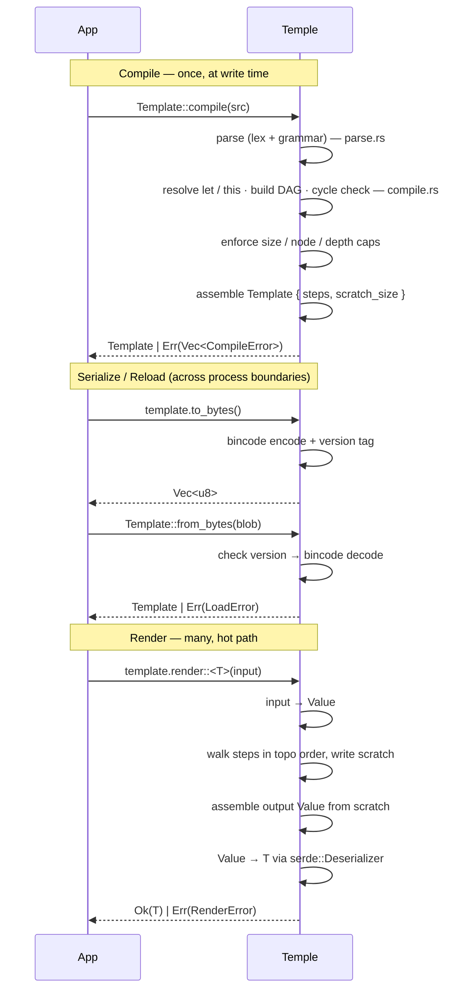

# Temple — Implementation Plan

> **Status:** the design lives in [`DESIGN.md`](DESIGN.md). This is the plan
> for turning it into ~2k lines of Rust. Nothing here is implemented yet.

## TL;DR

Hand-written lexer → chumsky parser → arena AST with spans → resolver builds a
topo-sorted DAG → tree-walking evaluator → bincode blob. ~2k LoC, 6
implementation files + `lib.rs`, 8 milestones.

## Stack

| Crate | Role |
| --- | --- |
| `chumsky` | parser — multi-error, native spans |
| `rust_decimal` | exact decimal arithmetic |
| `smol_str` | small inline strings |
| `indexmap` | order-preserving maps for object values |
| `serde` · `serde_json` | input conversion + `T` deserialization |
| `bincode` | compiled-blob format |
| `criterion` | benchmarks |

No diagnostics crate — roll a ~100-LoC line/col + snippet renderer inside
`error.rs`.

## File layout

6 implementation files + `lib.rs` facade, ~2.1k LoC.

- **`lib.rs`** (~50) — public surface + re-exports
- **`value.rs`** (~250) — `Value` enum, `From` / `Into` for `HashMap` / `serde_json::Value` / primitives, custom `serde::Deserializer` over `&Value`
- **`error.rs`** (~180) — `CompileError` / `RenderError` / `LoadError`, `Span`, line-col + snippet renderer
- **`parse.rs`** (~550) — AST node types, lexer (chumsky text mode), grammar combinators, multi-error collection
- **`compile.rs`** (~430) — `resolve` (let / this), DAG + cycle check, size/node/depth caps, `Template` struct + topo-ordered `EvalStep`s, `to_bytes` / `from_bytes` (bincode + version tag), `validate` wrapper
- **`eval.rs`** (~450) — `render`: input → `Value`, walk steps in topo order over scratch `Vec<Value>`, built-ins (`round` / `upper` / `lower` / `len` / `sum` / `any` / `all`) enum-dispatched, final `Value` → `T`
- **`format.rs`** (~200) — canonical pretty-printer over the AST

Each file = one phase. AST lives next to the parser (only place it is
constructed). Errors + diagnostics merged since they are one concern. Render +
built-ins merged since built-ins are only ever called from eval.

## Execution order

**Phase → file**

- `parse` → `parse.rs`
- `resolve · DAG · caps · assemble · ser/de · validate` → `compile.rs`
- `input → Value · walk steps · build output · serde` → `eval.rs`
- error types + diagnostic rendering, shared across all phases → `error.rs`
- `format` (independent author-time path; not in this diagram) → `format.rs`

## Key design choices

- **Tree-walking evaluator**, not bytecode — fits the budget; benchmark first, optimize only if needed
- **Spans on every AST node, day one** — retrofitting source spans is painful
- **Arena AST**: `Vec<Node>` + `NodeId(u32)` indices — cache-friendly, serializes cleanly
- **`chumsky` over `winnow`** — multi-error reporting + diagnostics out of the box
- **Topo-sort at compile** → store as `Vec<EvalStep>`; render is just iteration
- **Built-ins via `match` on an enum** — zero string hashing on the hot path
- **`Template` is immutable + `Send + Sync`**; the caller shares it via `Arc<Template>`
- **Scratch space** (`Vec<Value>` indexed by `StepId`) pre-allocated in `Template`; render reuses it
- **Custom `serde::Deserializer`** over `&Value` so `output Value → T` is one pass, no JSON round-trip
- **`to_bytes` = `[format_version: u32][bincode payload]`** — version mismatch ⇒ `LoadError::IncompatibleVersion`, caller re-`compile`s from source
- **Multi-error**: parser + resolver + caps each push into a `Vec<CompileError>`; `compile` returns `Err(vec)` if any, else `Ok(Template)`
- **Lambdas** are AST nodes, not values — exist only as method args; eval pushes params onto a tiny scope stack (no recursion)

## Build order

1. **MVP end-to-end** — `Value`, errors, minimal parser (paths + literals + bare holes), tree-walker, `Value → T`. Renders [`samples/minimal.temple`](samples/minimal.temple). (~500 LoC)
2. **Operators** — arithmetic / comparison / logical / `when` / `?:` with precedence. Renders [`samples/scalar_output.temple`](samples/scalar_output.temple).
3. **Safe access** — `?.`, `??`, missing-path → `RenderError::MissingPath { path, key, span }`.
4. **`let` + `this`** — resolver, topo-sort, cycle detection, ordered eval. Renders [`samples/receipt.temple`](samples/receipt.temple).
5. **Collections** — object/array constructor expressions, `.map` / `.filter` / `.fold` + lambdas + aggregates. Renders [`samples/collections.temple`](samples/collections.temple).
6. **Built-ins** — scalar helpers, enum-dispatched.
7. **Serialization + caps** — `to_bytes` / `from_bytes`, version tag, size/node/depth limits at compile.
8. **Polish** — `validate`, `format`, multi-error reporting through the pipeline, diagnostic rendering with snippets + did-you-mean, `criterion` benches against the perf targets.
