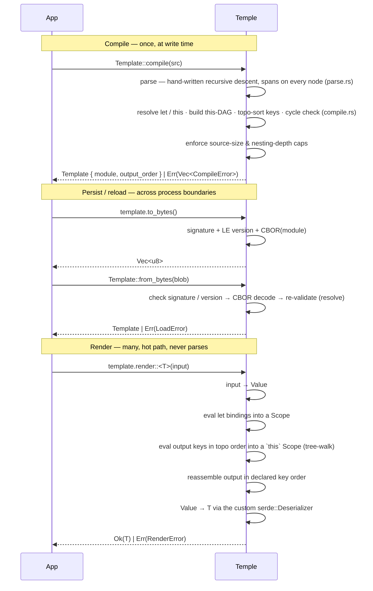

# Temple — Implementation

> [!NOTE]
> **As-built — milestones 1–7 of 8 done.** This documents what actually
> exists in `src/`; the forward-looking design lives in [`DESIGN.md`](DESIGN.md).
> The one open milestone (8) is diagnostics polish — see [Build order](#build-order).

## TL;DR

Hand-written recursive-descent parser → boxed-tree AST with a `Span` on every
node → resolver builds the `this`-dependency DAG and topo-sorts the output keys
→ tree-walking evaluator → versioned CBOR blob. ~3.4k LoC across `lib.rs` + five
implementation areas (`parse`, `compile`, `eval/`, `value`, `error`) + a
feature-gated CLI.

---

## Stack

| Crate | Role |
| --- | --- |
| `rust_decimal` | exact decimal arithmetic — no `f64` in the value model |
| `smol_str` | small inline strings for keys and identifiers |
| `indexmap` | order-preserving maps for object values |
| `serde` | AST `Serialize`/`Deserialize` (the blob) + the result deserialize boundary |
| `ciborium` | compiled-blob format (CBOR — self-describing, which `rust_decimal`'s `deserialize_any` requires and bincode can't give) |
| `serde_json` | **optional** (`cli` feature only) — JSON I/O for the `temple` binary |
| `criterion` | benchmarks (dev) |
| `cargo-husky` | git hooks — `fmt` + `clippy` pre-commit (dev) |

The parser is **hand-written**, not a combinator crate — full control over spans
and error messages, and one fewer dependency. Diagnostics are rolled in
`error.rs`, no diagnostic crate.

---

## File layout

Five implementation areas + a `lib.rs` facade + the CLI. ~3.4k LoC — past the
early ~2k estimate, mostly because the hand-written parser alone is ~1.4k.

| File | LoC | Role |
| --- | ---: | --- |
| `lib.rs` | 9 | public surface — re-exports `Template`, the error enums, `Value` |
| `value.rs` | 278 | the `Value` enum, `From`/`Into` conversions, a custom `serde::Deserializer` over `&Value`, and an iterative `Drop` |
| `error.rs` | 175 | `CompileError` / `RenderError` / `LoadError`, `Span`, `Display` impls |
| `parse.rs` | 1373 | AST node types (serde-derived), hand-written lexer + recursive-descent parser, spans on every node, depth cap |
| `compile.rs` | 518 | `resolve` (let / this), `this`-DAG + cycle check, size/depth caps, `Template`, `to_bytes` / `from_bytes` (CBOR), `validate`, `render` / `render_value` |
| `eval/` | 919 | the tree-walking evaluator, split by domain ↓ |
| `main.rs` | 90 | feature-gated `temple` CLI binary (`.temple` + JSON in → rendered JSON out) |

The evaluator was one large file; it is now a module split by concern:

| `eval/` file | LoC | Role |
| --- | ---: | --- |
| `mod.rs` | 136 | dispatch root — `evaluate` (output nodes), `evaluate_expr` (expressions), the shared `Scope` |
| `ops.rs` | 193 | binary/unary operators — arithmetic, comparison, equality, logical |
| `path.rs` | 208 | path traversal over a borrow cursor, array indexing, the value-depth guard |
| `methods.rs` | 180 | collection methods (`map`/`filter`/`fold`/…) and the lambda binding |
| `functions.rs` | 202 | built-in functions (`abs`/`round`/`min`/…) + scalar stringification |

> `format.rs` (canonical pretty-printer) is **not yet built** — it lands in milestone 8.

---

## Architecture

A boxed-tree AST, not an arena. Every `OutNode` / `Expr` carries a `Span`, and
the whole `Module` derives `Serialize`/`Deserialize` so the compiled form
round-trips through CBOR as-is. `Lit` is kept deliberately distinct from `Value`
so the serialized AST never forces `Value: Deserialize` — that gap is exactly
what makes `render::<Value>` a compile error.

**Phase → file**

- `parse` (lex + recursive descent + spans) → `parse.rs`
- `resolve · this-DAG · caps · to_bytes/from_bytes · validate · render` → `compile.rs`
- `evaluate output nodes & expressions, methods, functions` → `eval/`
- error types + `Display` rendering, shared across phases → `error.rs`
- `Value`, conversions, the `&Value` deserializer → `value.rs`

---

## Key design choices

- **Hand-written recursive-descent parser** with precedence-climbing
  (`parse_ternary` → `parse_coalesce` → … → `parse_primary`) — full control over
  spans and messages, zero parser dependency.
- **A `Span` on every AST node from day one** — retrofitting source spans is painful.
- **Boxed-tree AST** (`Expr { kind, span }`, `Box<Expr>` children), serde-derived
  — serializes cleanly to CBOR as the compiled blob; no separate arena/IR.
- **`Lit` ≠ `Value`** — the serialized AST never requires `Value: Deserialize`,
  which is what keeps `render::<Value>` a deliberate compile error.
- **Compile-time topo-sort of output keys** over the `this`-dependency DAG; render
  evaluates keys in dependency order into a `this` scope, then reassembles them in
  **declared** order. Cycles are rejected at compile.
- **Tree-walking evaluator** (`eval/`, split by domain) — fits the perf budget;
  benchmarked, not bytecoded.
- **Borrow-cursor path traversal** — `input.a.b.c` stays a borrow into the input
  and clones the final value once at the end, never the whole subtree.
- **Lambda scope cloned once per walk**, not per element — `map`/`filter`/`fold`
  overwrite only the parameter bindings each iteration.
- **Built-ins dispatched by matching the function name (`&str`)** — a small fixed
  set, no hash map on the hot path; `is_known_function` gates them at compile time.
- **No-panic guarantee, enforced structurally**: checked arithmetic, a parser
  depth cap (`MAX_DEPTH = 64`) and source-size cap (1 MiB), a render-time
  value-depth cap (`MAX_VALUE_DEPTH = 128` → `RenderError::ValueTooDeep`), and an
  **iterative `Drop` for `Value`** so dropping a deeply nested value can't overflow
  the stack.
- **Blob = `[signature "TMPL" (4B)][format_version: u32 LE][CBOR module]`** — a bad
  signature ⇒ `LoadError::Corrupt`, a version mismatch ⇒ `LoadError::IncompatibleVersion`;
  `from_bytes` **re-runs `resolve`**, so a corrupt or stale blob errors on load
  rather than risking a render-time panic. CBOR (via `ciborium`) because
  `rust_decimal` decodes through `deserialize_any`, which non-self-describing
  formats like bincode reject.
- **`Template` is immutable + `Send + Sync`** — the caller shares it behind `Arc<Template>`.

---

## Build order

1. ✅ **MVP** — `Value`, errors, minimal parser (paths + literals + bare holes), tree-walker, `Value → T`. Renders [`samples/minimal.temple`](samples/minimal.temple).
2. ✅ **Operators** — arithmetic / comparison / logical / `when` / `?:` with precedence. Renders [`samples/scalar_output.temple`](samples/scalar_output.temple).
3. ✅ **Safe access** — `?.`, `??`, missing-path → `RenderError::MissingPath`.
4. ✅ **`let` + `this`** — resolver, `this`-DAG, topo-sort, cycle detection, ordered eval. Renders [`samples/receipt.temple`](samples/receipt.temple).
5. ✅ **Collections** — object/array constructor expressions, `.map` / `.filter` / `.fold` + lambdas + aggregates. Renders [`samples/collections.temple`](samples/collections.temple).
6. ✅ **Built-ins** — scalar helpers, name-dispatched.
7. ✅ **Serialization + caps** — `to_bytes` / `from_bytes`, signature + version tag, size/depth limits at compile.
8. 🟡 **Polish** *(in progress)* — `format` (canonical pretty-printer), and source-underlined diagnostics with line/column + did-you-mean.

> **What multi-error already does:** the **resolver** collects every reference,
> cycle, and validation problem into one `Vec<CompileError>` per `compile`. Still
> milestone-8 work: the **parser** is fail-fast on the first syntax error, and
> messages print byte-offset spans (`at 12..15`) rather than line/column with an
> underlined source snippet.

---

## Tests & benchmarks

196 tests across feature-named integration files in [`tests/`](tests/) —
`basics`, `operators`, `safe_access`, `let_this`, `collections`, `functions`,
`constructors`, `blob`, `render_value`, and `robustness` (the no-panic guard:
caps, overflow, deep-value, UTF-8 spans). Criterion benches live in
[`benches/render_bench.rs`](benches/render_bench.rs); the out-of-crate Postgres
round-trip harness is in [`e2e/`](e2e/).
