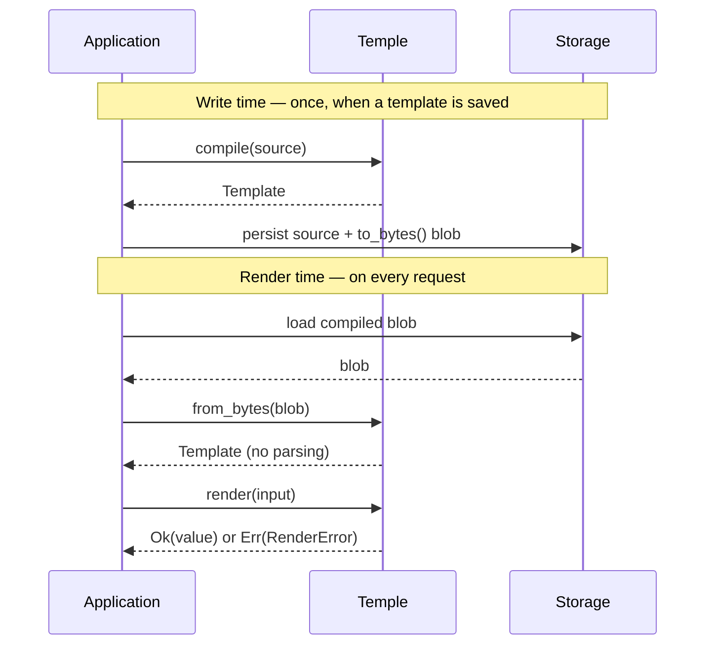

<div align="center">


# Temple

### A small, fast Rust DSL for shaping data — *input in, strongly-typed Rust value out.*

[](https://github.com/sinha-sahil/temple-dsl/actions/workflows/release.yml)
[](https://www.rust-lang.org)
[](https://github.com/sinha-sahil/temple-dsl/tags)


[**Install**](#install) · [**Quick start**](#quick-start) · [**The language**](#the-language) · [**Diagnostics**](#diagnostics) · [**How it works**](#how-it-works) · [**Reliability**](#reliability) · [**Design**](DESIGN.md)

</div>

---

You give Temple a **template** and an **input value**; it gives you back a value
deserialized straight into your Rust types. A template fixes the *shape* of the
output, with `{{ … }}` holes where values are computed:

<table>
<tr><th>Template</th><th>Input → Output</th></tr>
<tr><td>

```jsonc
let items = input.items
{
  "summary":  "{{ input.customer }} ordered {{ items.len() }} item(s)",
  "lines":    {{ items.map(it -> { "name": it.name, "total": it.qty * it.price }) }},
  "subtotal": {{ items.map(it -> it.qty * it.price).sum() }},
  "discount"?: {{ this.subtotal >= 100 ? round(this.subtotal * 0.1, 2) : null }},
  "receipt":  "Total due: {{ this.subtotal }}"
}
```

</td><td>

```jsonc
// input
{ "customer": "Ada",
  "items": [ { "name": "widget", "qty": 3, "price": 9.99 } ] }

// output — deserialized into your Receipt struct
{ "summary":  "Ada ordered 1 item(s)",
  "lines":    [ { "name": "widget", "total": 29.97 } ],
  "subtotal": 29.97,            // exact Decimal, never f64
  "receipt":  "Total due: 29.97" }
// "discount" dropped — `?:` omits null fields
```

</td></tr>
</table>

Compile once, render against millions of inputs — into your
`#[derive(Deserialize)]` struct, a `serde_json::Value`, or a dynamic `Value`.

> [!NOTE]
> **Pre-1.0, production-shaped.** The language, API, and author tooling are
> complete (milestones 1–8 of 9); 267 tests at ~86% line coverage, benchmarks,
> a CLI, and CI. The one open milestone is a [web editor component](M9-EDITOR.md).
> Expect breaking changes only across pre-1.0 versions.

---

## Why Temple

|  |  |
| --- | --- |
| 🎯 **Exact decimals** | `rust_decimal` end to end — `129.99 * 0.0825` is exactly `10.724175`. No `f64` exists anywhere in the value model. |
| 🦀 **Typed output** | Renders straight into your `#[derive(Deserialize)]` structs via a custom serde `Deserializer` — or a dynamic `Value` with `render_value`. |
| 🛡️ **Never panics** | `compile` / `render` / `from_bytes` return `Result` on *any* template or input — checked arithmetic, parser depth & size caps, value-depth cap, iterative drop. |
| ⚡ **Compile once, render many** | Parse · validate · dependency-graph analysis happen at write time. The render path never re-parses; sub-µs simple renders. |
| 📦 **Versioned blobs** | `to_bytes` / `from_bytes` persist the compiled form as a signature-tagged CBOR blob and reload it without parsing — store it in any `BYTEA`/`BLOB` column. |
| 🧭 **Author tooling** | `Template::format` canonicalizes a template; `compile` / `validate` report *every* error at once as rustc-style underlined snippets with did-you-mean hints. |
| 🪶 **Lean core** | Five small dependencies; `serde_json` and the CLI are opt-in behind a feature. No unsafe code. |

---

## Install

```toml
[dependencies]
temple-dsl = { git = "https://github.com/sinha-sahil/temple-dsl", branch = "release" }
```

crates.io publishing is wired through CI and lands with the next release. The
core library pulls in nothing extra; two opt-in features:

| Feature | Adds |
| --- | --- |
| `json` | exact `From` conversions to/from `serde_json::Value` — JSON flows straight into `render`, decimals travel as verbatim digit tokens (never `f64`) |
| `cli` | the `temple` binary (implies `json`) |

---

## Quick start

**Render into your own types** — compile once, render many:

```rust
use temple_dsl::{Template, Value};
use serde::Deserialize;

#[derive(Deserialize, Debug)]
struct Out { id: i64, name: String }

// Err(Vec<CompileError>) — every problem reported at once
let template = Template::compile(r#"{ "id": {{ input.id }}, "name": {{ upper(input.name) }} }"#)?;

let out: Out = template.render(Value::obj([
    ("id",   Value::Int(7)),
    ("name", Value::Str("ada".into())),
]))?;                                   // Out { id: 7, name: "ADA" }
```

**Dynamic output** when there's no struct: `template.render_value(input) -> Result<Value, RenderError>`.
(`render::<Value>` is deliberately a *compile error* — use `render_value`, it skips the serde round-trip.)

**JSON in, JSON out** — with the `json` feature there's no manual conversion:

```rust
let input: serde_json::Value = serde_json::from_str(request_body)?;
let out = serde_json::Value::from(template.render_value(input)?);
// decimals stay exact in both directions — verbatim digits, never f64
```

**Persist the compiled form** and skip parsing at render time:

```rust
let blob: Vec<u8> = template.to_bytes();        // → store in any BYTEA/BLOB column
let loaded = Template::from_bytes(&blob)?;      // deserialize + re-validate, no parse
let out: Out = loaded.render(input)?;
```

Every fallible call returns a structured error (`CompileError`, `RenderError`,
`LoadError`) — Temple never panics and never decides failure handling for you.

---

## The language

A `.temple` document is an optional `let` preamble followed by one output
literal. Bare `{{ expr }}` holes yield a typed value; quoted `"… {{ expr }} …"`
holes interpolate into a string. Entries are separated by commas **or
newlines**; trailing commas are always fine; `#` starts a comment.

| Feature | Looks like |
| --- | --- |
| **Paths & access** | `input.cart.subtotal` · `input.items[0]` · `obj["key"]` · `input.coupon?.code ?? "none"` |
| **Operators** | `+ - * / %` · `== != < <= > >=` · `&& \|\| !` · `cond ? a : b` |
| **`when` guards** | `when { score >= 90: "A", score >= 80: "B", else: "C" }` |
| **`let` + `this`** | preamble `let`, plus `this.total` reads a sibling key — order-free, cycle-checked at compile time |
| **`let … in …`** | local bindings anywhere: `let rate = … in subtotal * rate` (incl. inside `when`) |
| **Array methods** | `.map` `.filter` `.fold` `.sum` `.any` `.all` `.count` `.find` `.contains` `.index_of` `.sort` `.sort_by` `.reverse` `.unique` `.flatten` `.flat_map` `.take` `.drop` `.slice` `.join` `.min` `.max` `.avg` `.first` `.last` `.concat` `.len` |
| **String methods** | `.contains` `.starts_with` `.ends_with` `.replace` `.split` `.slice` `.index_of` `.len` |
| **Object methods** | `.keys` `.values` `.entries` `.has` `.get` `.merge` |
| **Lambdas** | `x -> x * 2` · `(acc, x) -> acc + x` — bounded iteration only, never Turing-complete |
| **Constructors** | array `[a, b]`, object `{ "k": expr }`, **computed keys** `{ [expr]: v }`, **omit-if-null** `"k"?: expr` |
| **Built-in functions** | `abs` `round` `floor` `ceil` `min` `max` `upper` `lower` `trim` `to_string` `to_number` `concat` `type_of` `is_*` `json_encode` `url_encode` `base64` |

Methods chain on *any* expression — `[3, 1].sort()`, `f(x).replace(…)`,
`(a.concat(b)).len()` — not just paths. Put together, that covers real work like
building an HTTP request with computed headers and conditional fields:

```jsonc
{
  "url":      {{ concat("https://", input.host, "/v1/rules") }},
  "headers":  { "Authorization": {{ concat("Bearer ", input.token) }} },
  "trace_id"?: {{ input.trace_id }},                       # absent when null
  "by_category": {{ input.items.fold({}, (acc, it) ->     # group-by via computed keys
      acc.merge({ [it.cat]: (acc.get(it.cat) ?? 0) + it.qty })) }}
}
```

See [`DESIGN.md`](DESIGN.md) for the complete spec and [`samples/`](samples/)
for worked templates — every shipped sample is compile-tested in CI.

---

## Diagnostics

`compile` and `validate` report **all** problems in one pass — parser recovery
plus resolver collection — and each error renders as an underlined snippet with
line/column and a *did-you-mean* hint when a name is a near-miss:

```text
error: unknown identifier 'inputt' — did you mean `input`?
  --> 2:15
  |
2 |   "total": {{ inputt.cart.subtotal }},
  |               ^^^^^^

error: unknown function 'rouns' — did you mean `round`?
  --> 3:15
  |
3 |   "tier":  {{ rouns(this.total) }}
  |               ^^^^^
```

Programmatic access: every error carries a `Span`; `CompileError::report(src)`
renders one snippet, `CompileError::report_all(src, &errs)` renders the batch.
`Template::format(src)` re-emits any parseable template in the canonical
layout — deterministic and idempotent, ready for format-on-save.

---

## CLI

The feature-gated `temple` binary renders a template against a JSON input, or
prints its canonical formatting:

```bash
cargo install --path . --features cli

temple order.temple input.json    # render → JSON on stdout
temple fmt order.temple           # canonical formatting on stdout
```

Compile errors print as the underlined snippets above; exit codes are
script-friendly (`0` ok, `1` error, `2` usage).

---

## How it works

A template is compiled **once**, at save time — parsing, validation, and
dependency-graph analysis all happen there. The render path loads the compiled
artifact and evaluates it **without re-parsing**, so render latency is bounded
by construction, not by template size at request time.



The blob is a signature-tagged, versioned CBOR encoding of the compiled module;
`from_bytes` re-runs validation on load, so a corrupt or version-stale blob is
rejected (recompile from the stored source) — never rendered.

---

## Performance

Tree-walking evaluator, measured with `cargo bench` (Criterion, release):

| Benchmark | Time |
| --- | ---: |
| `compile_small` — 3-field template | ~0.8 µs |
| `compile_big` — ~30 fields, 4 levels deep | ~8 µs |
| `render_small` | ~0.5 µs |
| `render_big` — 30 fields, decimals, struct round-trip | ~5.5 µs |
| compile + render — cold path | ~1.4 µs |

Render cost scales with template size **plus the input elements a render
visits** — a large *passive* input subtree adds nothing. A `let … in …` binding
is an O(1) scope overlay, and lambdas flatten their scope once per collection
walk, never per element. Memory: a compiled template holds ~15× its source in
RAM (≈1.5 KB for a small one); a render allocates ~1 KB transient.

---

## Reliability

The crate is built around a **no-panic guarantee**: `compile`, `render`, and
`from_bytes` return typed errors on *any* template and *any* input.

- **Enforced structurally** — checked arithmetic everywhere, parser depth cap,
  1 MiB source cap, render-time value-depth cap, and an iterative `Drop` so even
  dropping a pathologically deep value cannot overflow the stack.
- **268 tests, ~86% line coverage** — feature-named suites plus a kitchen-sink
  test that exercises *every* operator, method, builtin, and structural feature
  in one template, asserted value-exactly and pushed through the blob and
  formatter round-trips.
- **Thrash-tested** — fuzz-style sweeps over malformed sources, deep nesting,
  overflow inputs, and corrupted blobs (~245k cases at last full run).
- **Round-trip invariants under test** — `format` is idempotent and its output
  always re-parses; `to_bytes`→`from_bytes` renders identically to the original.
- **Deterministic** — no I/O, clocks, or randomness in the language by design:
  same template + input ⇒ same output, always.

---

## How Temple compares

Temple needs four things at once. Existing crates each miss at least one:

| Crate | Sub-ms render | Exact decimals | Typed Rust output | Focused surface |
| --- | :---: | :---: | :---: | :---: |
| `minijinja` | ✓ | ✗ | ✗ | ✗ |
| `jaq` | ✓ | ✗ | ✗ | ✗ |
| `jsonata-core` | ~ | ✗ | ✗ | ✗ |
| `liquid_json` | ~ | ✗ | ✗ | ~ |
| **Temple** | **✓** | **✓** | **✓** | **✓** |

<sub>✓ yes · ~ partial · ✗ no. Evaluated for Temple's specific needs — not a general verdict on these crates.</sub>

---

## Status & roadmap

The language, API, and author tooling are **complete**. The single remaining
milestone is **M9 — a web editor component**: a browser widget that compiles
the same engine to WASM and provides intellisense, inline diagnostics, and
format-on-save out of the box. Plan: [`M9-EDITOR.md`](M9-EDITOR.md).

<details>
<summary><b>Full capability matrix</b> — milestones 1–8 of 9 done</summary>

<br>

| Capability | Status |
| --- | :---: |
| Object / array / scalar output, value literals | ✅ |
| Bare-hole expressions, path access (`input.a.b.c`) | ✅ |
| Comments (`#`), trailing commas, newline-separated entries | ✅ |
| Decimal-correct arithmetic via `rust_decimal` | ✅ |
| Typed output — `render::<T>` (serde) or `render_value` (dynamic `Value`); `render::<Value>` is a compile error | ✅ |
| Compile once, render many (in-memory `Template`) | ✅ |
| `Result` everywhere, no panics — checked arithmetic, parser depth/size caps, value-depth cap, iterative drop | ✅ |
| Operators (`+ - * / %`, comparison, logical, unary `-`/`!`, parens) | ✅ |
| Conditionals (`when` guards, ternary `?:`, short-circuit `&&`/`\|\|`) | ✅ |
| Safe access `?.` and nullish coalesce `??` | ✅ |
| `let` preamble, `this` self-reference, compile-time DAG (cycle detection) | ✅ |
| Core methods (`map`/`filter`/`fold`/`sum`/`any`/`all`/`len`/`first`/`last`/`concat`), lambdas, `arr[i]` indexing | ✅ |
| Array stdlib: `count`/`find`/`contains`/`index_of`/`sort`/`sort_by`/`reverse`/`unique`/`flatten`/`flat_map`/`take`/`drop`/`slice`/`join`/`min`/`max`/`avg` | ✅ |
| String methods: `contains`/`starts_with`/`ends_with`/`replace`/`split`/`slice`/`index_of` | ✅ |
| Object methods + indexing: `keys`/`values`/`entries`/`has`/`get`/`merge`, `obj["k"]` | ✅ |
| `%` operator; `to_number`, `type_of`/`is_*`, `concat`, `json_encode`, `url_encode`, `base64` | ✅ |
| Constructors: array `[…]`, object `{ "k": expr }`, computed keys `{ [expr]: v }`, omit-if-null `"k"?:` | ✅ |
| `let … in …` local bindings; method/index chains on any expression | ✅ |
| String interpolation in quoted holes — `"Hi {{ input.name }}"` (incl. `\{` escape) | ✅ |
| Built-in scalar functions (`abs` … `to_string`) | ✅ |
| `validate(src)` author-time check; size/depth caps (early rejection) | ✅ |
| `to_bytes` / `from_bytes` — versioned compiled blob, reload without reparsing | ✅ |
| `Template::format` — canonical, idempotent pretty-printer | ✅ |
| Diagnostics — multi-error reporting with parser recovery, rustc-style underlined snippets, did-you-mean | ✅ |
| **Milestone 9** — web editor component (intellisense, inline diagnostics, format-on-save) | 🟡 planned |

</details>

---

## Project layout

| Path | What's there |
| --- | --- |
| [`src/`](src/) | The library + the feature-gated `temple` CLI binary |
| [`DESIGN.md`](DESIGN.md) | Full language spec, decisions, open questions |
| [`IMPLEMENTATION.md`](IMPLEMENTATION.md) | As-built map: file layout, sequence diagram, design choices |
| [`M9-EDITOR.md`](M9-EDITOR.md) | Plan for the milestone-9 web editor component |
| [`CAPABILITY-GAPS.md`](CAPABILITY-GAPS.md) | The feature-expansion record — what was added and why |
| [`FAQ.md`](FAQ.md) | How the engine actually works inside |
| [`samples/`](samples/) | Canonical `.temple` templates, one per pattern (compile-tested) |
| [`examples/`](examples/) | Runnable Rust demos against the public API |
| [`benches/`](benches/) | Criterion benchmark suite |
| [`e2e/`](e2e/) | Out-of-crate end-to-end (Postgres) harness |

## Developing

```bash
cargo test --all-features     # full suite (267 tests)
cargo bench                   # Criterion benchmarks
cargo llvm-cov --all-features # coverage report
```

`cargo fmt` + `cargo clippy -D warnings` are enforced by a pre-commit hook
(installed automatically via `cargo-husky`) and by CI on the release branch.

---

## Author

**[Sahil Sinha](https://github.com/sinha-sahil)** · `sahilsinha.dar@gmail.com`

## License

Dual-licensed under **MIT OR Apache-2.0** — use it under either at your option.
