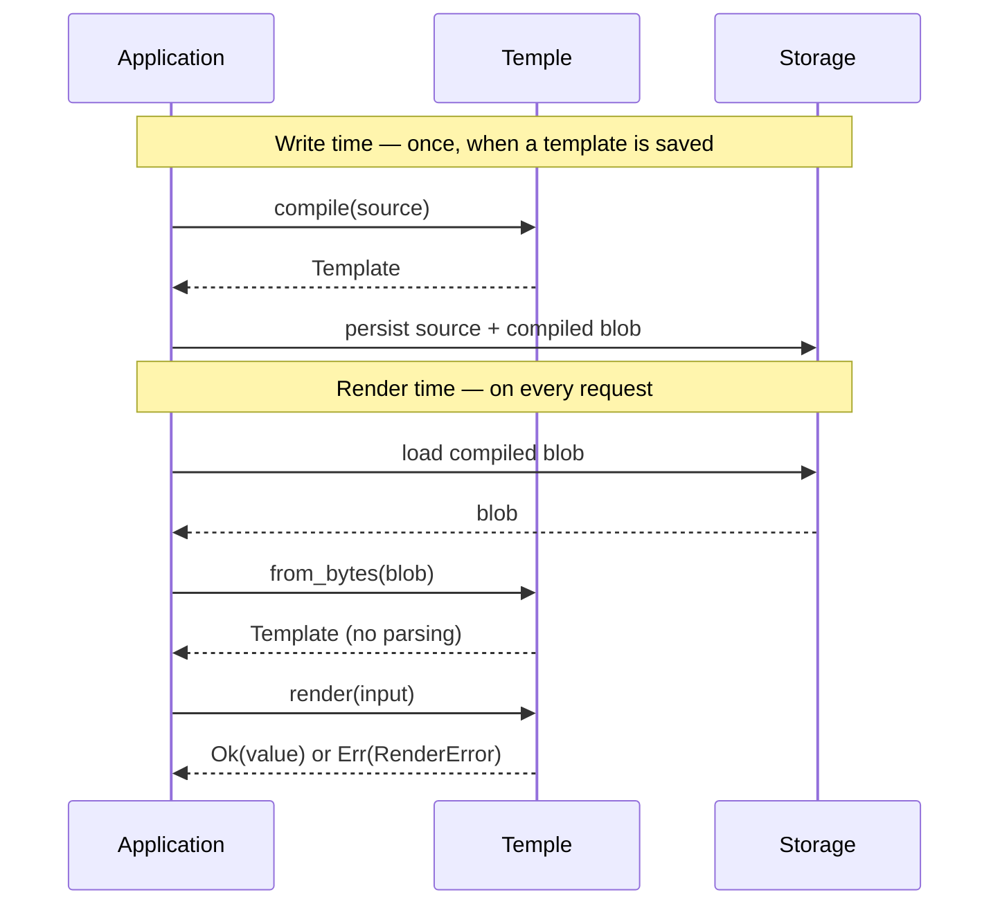

# 🏛️ Temple

> A small, fast Rust DSL for shaping data — input in, strongly-typed Rust value out.

> [!NOTE]
> **Active development — milestones 1–5 / 8 implemented.** Everything
> below is wired end-to-end with tests, examples, benchmarks, and a CLI
> binary: literals, paths, operators, conditionals, `when`, ternary,
> safe access (`?.` / `??`), `let` preamble, `this` self-reference and
> the compile-time DAG, plus collection methods (`.map` / `.filter` /
> `.fold` / `.length` / `.first` / `.last` / `.concat`), `x -> body`
> lambdas, `arr[i]` indexing, and array literals in expressions. The
> persistence blob (`to_bytes` / `from_bytes`) and the polish layer
> (`validate` / `format` / multi-error diagnostics) are *designed but
> not yet built* — see [`IMPLEMENTATION.md`](IMPLEMENTATION.md) for the
> build order and [`DESIGN.md`](DESIGN.md) for the full language spec.

## Overview

Temple takes an **input value** and a **template**, and returns a value
deserialized straight into your Rust types. A template describes the *shape*
of the output, with `{{ … }}` holes where values are computed.

It is a small, hand-rolled, dynamically-typed interpreter — built for one job:
reshape data, fast. A template compiles once and renders against many inputs.

**Built for** — templating, rule engines, and reshaping data on the fly.

## Example (what runs today)

```
let items = input.items
let total = items.fold(0, (acc, item) -> acc + item.price * item.qty)
{
    "count":         {{ items.length() }},
    "item_names":    {{ items.map(item -> item.name) }},
    "discounted":    {{ items.filter(item -> item.price >= 5).map(item -> item.name) }},
    "first_item":    {{ items[0].name }},
    "total":         {{ total }},
    "average":       {{ total / items.length() }},
    "free_shipping": {{ this.total >= 50 }}
}
```

`let` names a sub-expression once. Methods chain naturally: `.filter(...)`
narrows the list, `.map(...)` projects each element, `.fold(...)`
collapses to a single value. Lambdas are `param -> body` or
`(p1, p2) -> body` — bounded iteration only, no closures stored
anywhere. `this.<key>` references other output keys; the compiler
topo-sorts them and rejects cycles at compile time.

See [`DESIGN.md`](DESIGN.md) for the language spec and the
implementation-status table below for what is wired up today.

## Quick start

```rust
use temple_dsl::{Template, Value};
use serde::Deserialize;

#[derive(Deserialize, Debug)]
struct Out { id: i64, name: String }

let src = r#"{ "id": {{ input.id }}, "name": {{ input.name }} }"#;
let template = Template::compile(src).unwrap();
let input = Value::obj([
    ("id",   Value::Int(7)),
    ("name", Value::Str("Ada".into())),
]);

match template.render::<Out>(input) {
    Ok(out) => println!("{:?}", out),
    Err(e)  => eprintln!("{}", e),
}
```

## CLI

A feature-gated `temple` binary runs a `.temple` file against a JSON input file:

```bash
cargo install --path . --features cli
temple some_template.temple some_input.json
```

The library itself stays lean — `serde_json` only enters the dep tree when the
`cli` feature is enabled. Downstream library consumers get just the API.

## Implementation status

| Capability | Status |
| --- | --- |
| Object / array / scalar output, value literals | ✅ |
| Bare-hole expressions, path access (`input.a.b.c`) | ✅ |
| Comments (`#`), trailing commas | ✅ |
| Decimal-correct arithmetic via `rust_decimal` | ✅ |
| Typed output — serde `Deserializer` over `&Value` | ✅ |
| Compile once, render many (in-memory `Template`) | ✅ |
| `Result` everywhere, no panics | ✅ |
| Operators (`+ - * /`, comparison, logical, unary `-`/`!`, parens) | ✅ |
| Conditionals (`when` guards, ternary `?:`, short-circuit `&&`/`\|\|`) | ✅ |
| Safe access `?.` and nullish coalesce `??` | ✅ |
| `let` preamble, `this` self-reference, compile-time DAG (cycle detection) | ✅ |
| Methods (`.map` / `.filter` / `.fold` / `.length` / `.first` / `.last` / `.concat`), `x -> body` lambdas, `arr[i]` indexing, array literals | ✅ |
| Built-in functions (`round`, `upper`, …) | 🟡 designed — milestone 6 |
| `to_bytes` / `from_bytes` (compiled blob) | 🟡 designed — milestone 7 |
| `validate` / `format` / multi-error / diagnostics | 🟡 designed — milestone 8 |

## Performance (MVP, tree-walking evaluator)

Measured with Criterion on the current implementation:

| Bench | Time |
| --- | --- |
| `compile_small` (3-field template) | ~326 ns |
| `compile_big` (~80 lines, ~30 fields, 4 levels) | ~4.37 µs |
| `render_small` | ~337 ns |
| `render_big` (30 fields, decimals, struct round-trip) | ~4.18 µs |
| `compile_and_render_small` (cold path) | ~679 ns |

Design targets — sub-1 ms render typical, sub-100 µs simple — hold with
~200× headroom on the big template. Reproduce with `cargo bench`.

## How it works

A template is compiled **once**, when it is saved — parsing, validation, and
(future) dependency analysis happen there. The render path loads the compiled
artifact and evaluates it without re-parsing.



(Today `to_bytes` / `from_bytes` are stubs — milestone 7 — so the persistence
arrows above describe the design target, not the current build.)

## How Temple compares

Temple needs four things at once. Existing crates each miss at least one:

| Crate | Sub-ms render | Exact decimals | Typed Rust output | Focused surface |
| --- | :---: | :---: | :---: | :---: |
| `minijinja` | ✓ | ✗ | ✗ | ✗ |
| `jaq` | ✓ | ✗ | ✗ | ✗ |
| `jsonata-core` | ~ | ✗ | ✗ | ✗ |
| `liquid_json` | ~ | ✗ | ✗ | ~ |
| **Temple** | **✓** | **✓** | **✓** | **✓** |

*✓ yes · ~ partial · ✗ no. Our evaluation for Temple's specific needs — not a general verdict on these crates.*

## Project layout

- **[`DESIGN.md`](DESIGN.md)** — full language spec, decisions, open questions.
- **[`IMPLEMENTATION.md`](IMPLEMENTATION.md)** — build order, file layout, sequence diagram, design choices.
- **[`FAQ.md`](FAQ.md)** — how the engine actually works inside.
- **[`samples/`](samples/)** — canonical template examples (some use later-milestone features).
- **[`examples/`](examples/)** — runnable Rust demos against the current MVP.
- **[`benches/`](benches/)** — Criterion benchmark suite.
- **`src/`** — library + the feature-gated CLI binary.

## Author

[Sahil Sinha](https://github.com/sinha-sahil) · `sahilsinha.dar@gmail.com`

## License

Planned: dual-licensed **MIT OR Apache-2.0**.
