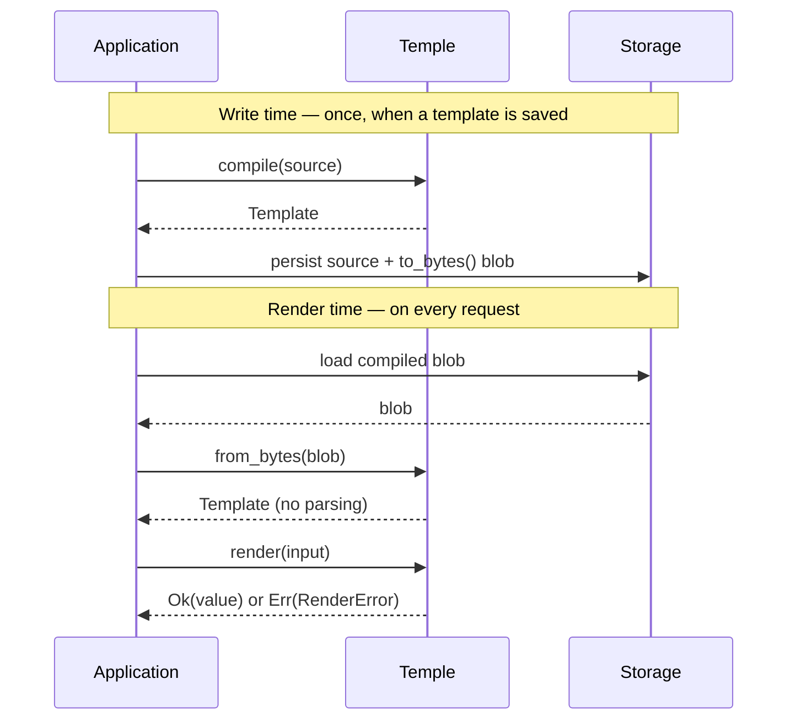

<div align="center">


# Temple

### A small, fast Rust DSL for shaping data — *input in, strongly-typed Rust value out.*

[](https://github.com/sinha-sahil/temple-dsl/actions/workflows/release.yml)
[](https://www.rust-lang.org)


[**Install**](#install) · [**Quick start**](#quick-start) · [**The language**](#the-language) · [**How it works**](#how-it-works) · [**Design**](DESIGN.md)

</div>

---

You give Temple a **template** and an **input value**; it gives you back a value
deserialized straight into your Rust types. A template fixes the *shape* of the
output, with `{{ … }}` holes where values are computed:

```jsonc
let items = input.items
{
  "summary":  "{{ input.customer }} ordered {{ items.length() }} item(s)",
  "lines":    {{ items.map(it -> { "name": it.name, "total": it.qty * it.price }) }},
  "subtotal": {{ items.map(it -> it.qty * it.price).sum() }},
  "any_bulk": {{ items.any(it -> it.qty >= 5) }},
  "receipt":  "Total due: {{ this.subtotal }}"
}
```

→ compiles once, then renders against millions of inputs into a `Receipt` struct
(or a `serde_json::Value`, or a dynamic `Value`) — with `subtotal` an **exact
decimal**, never an `f64` approximation.

> [!NOTE]
> **Usable today — pre-1.0, milestones 1–7 of 8 done.** Temple is a working
> library covered by ~200 tests, runnable examples, benchmarks, a CLI, and CI.
> The whole language is in; the one open milestone (8) is *diagnostics polish*
> (`format`, multi-error reporting, source-underlined messages) — developer
> experience, not functionality. Stable enough to build on; expect breaking
> changes only across pre-1.0 versions.

---

## Why Temple

|  |  |
| --- | --- |
| 🎯 **Exact decimals** | `rust_decimal` end to end — `129.99 * 0.0825` is exactly `10.724175`. No `f64` lives anywhere in the value model. |
| 🦀 **Typed output** | Renders straight into your `#[derive(Deserialize)]` structs via a custom serde `Deserializer` — or a dynamic `Value` with `render_value`. |
| 🛡️ **Never panics** | `compile` / `render` / `from_bytes` return `Result` on *any* template or input — checked arithmetic, parser depth & size caps, value-depth cap, iterative drop. |
| ⚡ **Compile once, render many** | Parse · validate · dependency-graph analysis all happen at write time. The render path never re-parses. |
| 📦 **Versioned blobs** | `to_bytes` / `from_bytes` persist the compiled form as a tagged CBOR blob and reload it without parsing — store it in any `BYTEA`/`BLOB` column. |
| 🪶 **Lean core** | Tiny dependency surface; `serde_json` and the CLI are opt-in behind a feature. |

---

## Install

Add it from git (crates.io publishing is wired through CI and lands on the next release):

```toml
[dependencies]
temple-dsl = { git = "https://github.com/sinha-sahil/temple-dsl", branch = "release" }
```

Optional feature `cli` adds the `temple` binary + JSON I/O. The core library pulls
in nothing extra. (Database / end-to-end tests live outside the crate in [`e2e/`](e2e/).)

---

## Quick start

```rust
use temple_dsl::{Template, Value};
use serde::Deserialize;

#[derive(Deserialize, Debug)]
struct Out {
    id: i64,
    name: String,
}

// Compile once …
let template = Template::compile(r#"{ "id": {{ input.id }}, "name": {{ input.name }} }"#).unwrap();

// … render many.
let input = Value::obj([
    ("id",   Value::Int(7)),
    ("name", Value::Str("Ada".into())),
]);

match template.render::<Out>(input) {
    Ok(out) => println!("{out:?}"),   // Out { id: 7, name: "Ada" }
    Err(e)  => eprintln!("{e}"),       // structured RenderError, never a panic
}
```

Want the dynamic value instead of a typed struct? Use `render_value(input) -> Result<Value, _>`.
(`render::<Value>` is intentionally a *compile error* — it would be a pointless serde round-trip.)

---

## The language

A `.temple` document is an optional `let` preamble followed by one output literal.
Bare `{{ expr }}` holes yield a typed value; quoted `"… {{ expr }} …"` holes interpolate into a string.

| Feature | Looks like |
| --- | --- |
| **Paths & safe access** | `input.cart.subtotal` · `input.items[0]` · `input.coupon?.code ?? "none"` |
| **Operators** | `+ - * /` · `== != < <= > >=` · `&& \|\| !` · `cond ? a : b` |
| **`when` guards** | `when { score >= 90: "A", score >= 80: "B", else: "C" }` |
| **`let` + `this`** | name a sub-expression once; `this.total` reads a sibling output key — order-free, cycle-checked at compile time |
| **Collection methods** | `.map` · `.filter` · `.fold` · `.sum` · `.any` · `.all` · `.len` · `.first` · `.last` · `.concat` |
| **Lambdas** | `x -> x * 2` · `(acc, x) -> acc + x` — bounded iteration only, no closures stored |
| **Constructors** | array literals `[a, b]` and object literals `{ "k": expr }` inside expressions |
| **Built-in functions** | `abs` `round` `floor` `ceil` `min` `max` `upper` `lower` `trim` `to_string` `len` |

Methods chain into a pipeline, and `this` lets output keys depend on each other in any order:

```jsonc
let cart = input.cart
{
  "in_stock": {{ cart.items.filter(it -> it.available) }},
  "subtotal": {{ this.in_stock.map(it -> it.price * it.qty).sum() }},
  "discount": {{ this.subtotal >= 100 ? round(this.subtotal * 0.10, 2) : 0 }},
  "total":    {{ this.subtotal - this.discount }}
}
```

See [`DESIGN.md`](DESIGN.md) for the complete spec and [`samples/`](samples/) for worked templates.

---

## CLI

A feature-gated `temple` binary runs a `.temple` file against a JSON input file:

```bash
cargo install --path . --features cli
temple some_template.temple some_input.json
```

The library stays lean — `serde_json` only enters the dependency tree with the `cli` feature on.

---

## How it works

A template is compiled **once**, at save time — parse, validate, and
dependency-graph analysis all happen there. The render path loads the compiled
artifact and evaluates it **without re-parsing**, so render latency is bounded
by construction, not by template size at request time.



The blob is a signature-tagged, versioned CBOR encoding of the compiled module;
`from_bytes` re-runs validation on load, so a corrupt or stale blob is rejected
(and you recompile from the stored source) — never rendered.

---

## Performance

Tree-walking evaluator, measured with `cargo bench` (Criterion, release):

| Benchmark | Time |
| --- | ---: |
| `compile_small` — 3-field template | ~0.8 µs |
| `compile_big` — ~30 fields, 4 levels | ~7.7 µs |
| `render_small` | ~0.5 µs |
| `render_big` — 30 fields, decimals, struct round-trip | ~5.5 µs |
| `compile + render` — cold path | ~1.3 µs |

Render cost scales with template size **plus the input elements a render
visits** — a large *passive* input subtree adds nothing. Memory: a compiled
template holds ~15× its source in RAM (≈1.5 KB for a small one); a render
allocates ~1 KB transient, freed when the output drops. Design targets —
sub-1 ms typical, sub-100 µs simple — hold with comfortable headroom.

---

## How Temple compares

Temple needs four things at once. Existing crates each miss at least one:

| Crate | Sub-ms render | Exact decimals | Typed Rust output | Focused surface |
| --- | :---: | :---: | :---: | :---: |
| `minijinja` | ✓ | ✗ | ✗ | ✗ |
| `jaq` | ✓ | ✗ | ✗ | ✗ |
| `jsonata-core` | ~ | ✗ | ✗ | ✗ |
| `liquid_json` | ~ | ✗ | ✗ | ~ |
| **Temple** | **✓** | **✓** | **✓** | **✓** |

<sub>✓ yes · ~ partial · ✗ no. Evaluated for Temple's specific needs — not a general verdict on these crates.</sub>

---

## Implementation status

<details>
<summary><b>Full capability matrix</b> — 1–7 of 8 milestones done</summary>

<br>

| Capability | Status |
| --- | :---: |
| Object / array / scalar output, value literals | ✅ |
| Bare-hole expressions, path access (`input.a.b.c`) | ✅ |
| Comments (`#`), trailing commas | ✅ |
| Decimal-correct arithmetic via `rust_decimal` | ✅ |
| Typed output — `render::<T>` (serde) or `render_value` (dynamic `Value`); `render::<Value>` is a compile error | ✅ |
| Compile once, render many (in-memory `Template`) | ✅ |
| `Result` everywhere, no panics — checked arithmetic, parser depth/size caps, value-depth cap, iterative drop | ✅ |
| Operators (`+ - * /`, comparison, logical, unary `-`/`!`, parens) | ✅ |
| Conditionals (`when` guards, ternary `?:`, short-circuit `&&`/`\|\|`) | ✅ |
| Safe access `?.` and nullish coalesce `??` | ✅ |
| `let` preamble, `this` self-reference, compile-time DAG (cycle detection) | ✅ |
| Methods (`map`/`filter`/`fold`/`sum`/`any`/`all`/`len`/`first`/`last`/`concat`), lambdas, `arr[i]` indexing | ✅ |
| Constructors: array literals `[…]` and object literals `{ "k": expr }` | ✅ |
| String interpolation in quoted holes — `"Hi {{ input.name }}"` | ✅ |
| Built-in functions: `abs`, `round`, `floor`, `ceil`, `min`, `max`, `upper`, `lower`, `trim`, `to_string`, `len` | ✅ |
| `validate(src)` author-time check; size/depth caps (early rejection) | ✅ |
| `to_bytes` / `from_bytes` — versioned compiled blob, reload without reparsing | ✅ |
| **Milestone 8** — `format`, multi-error reporting, source-underline diagnostics | 🟡 planned |

</details>

**Roadmap:** the only remaining milestone is **diagnostics polish** (M8) — a
canonical `format`, reporting every error in one pass, and messages that
underline the offending source span. Pure developer experience; the language
and API are complete.

---

## Project layout

| Path | What's there |
| --- | --- |
| [`src/`](src/) | The library + the feature-gated `temple` CLI binary |
| [`DESIGN.md`](DESIGN.md) | Full language spec, decisions, open questions |
| [`IMPLEMENTATION.md`](IMPLEMENTATION.md) | Build order, file layout, sequence diagram, design choices |
| [`FAQ.md`](FAQ.md) | How the engine actually works inside |
| [`samples/`](samples/) | Canonical `.temple` templates, one per pattern |
| [`examples/`](examples/) | Runnable Rust demos against the public API |
| [`benches/`](benches/) | Criterion benchmark suite |
| [`e2e/`](e2e/) | Out-of-crate end-to-end (Postgres) harness |

---

## Author

**[Sahil Sinha](https://github.com/sinha-sahil)** · `sahilsinha.dar@gmail.com`

## License

Dual-licensed under **MIT OR Apache-2.0** — use it under either at your option.
